<style>
body { min-width: 80% !important; }
img {
/*    max-width:500px; */
	max-width:50%;
}
code {
  white-space : pre-wrap !important;
}
</style>

<!--<style>
body {
  font-family: "Arial", sans-serif;
}
</style>-->

Created by: pc2005 (@vogons or @retroweb discord)

## Introduction

Would you like to run your 486 motherboard with a _really_ _good_ configuration?

The story started many years ago, when I was playing with a baremetal code ("BIOS") for ABit AB-PB4. The project has been put on a hiatus after I created a serial console which allowed me to poke memory and IO space. It was even possible to manually dump sectors from CDROM, but I lost the interest to write an API and turn the "BIOS" into a primitive OS. Years later when I've discovered the Retroweb I've returned to the idea while being equipped with modern tools.

Also with GNU/Linux.

NOTICE This isn't strictly chronological.

NOTICE^2 Most of the blog was written using [Biostar MB-8433UUD motherboard](https://theretroweb.com/motherboards/s/biostar-mb-8425uud-a), AMD 5x86-133 and 128MB EDO DRAM.

Also thanks to Martes @retroweb discord for borrowing me [Intel Classic/PCI ED (Ninja)](https://theretroweb.com/motherboards/s/intel-classic-pci-ed-ninja) and a better camera.

<!-- TODO overview video? -->

### Boot the modern linux on 486

Let's say we want to boot a linux distribution on a 486 motherboard. We hit the wall even before downloading anything. The is almost none modern distribution which is compiled for 486 architecture and if we find a 486 compatible distribution installation image we gonna quickly hit another wall: old BIOSes doesn't support boot from a CD drive. The we can set up an SD card and then we will hit the third wall: old BIOSes doesn't also support big drives and if they do (~ 8GB) LBA addressing support for them is terrible.


Because I like to change the things from the ground, the best solution is to use a modern implementation of the BIOS.

## Coreboot

[Coreboot](https://www.coreboot.org/) just do the hardware initialization and loads payloads. The hardware initialization part set chipset's registers, detects RAM and cache size, enumerates the PCI bus and create system tables (SMBIOS, MP, ACPI, ...). Then it can choose one of the payloads and run it (e.g. one is a doom clone). The most important payload is an implementation of the IBM compatible BIOS. It is called [SeaBIOS](https://www.seabios.org/SeaBIOS).

Chronologically the first board with added support was [ABit AB-PB4](https://theretroweb.com/motherboards/s/abit-ab-pb4-rev-1.3). Thanks for my experiments years ago I could use experience with the FinALI chipset, which is documented [here](https://theretroweb.com/chipsets/174#docs).

### Obtaining the coreboot

We need to download existing git repository:

```bash
cd where_git_repositories_are_located
git clone --recursive https://github.com/pc2005cz/coreboot_486.git
cd coreboot_486
```

Alternatively we can clone the vanilla repo and checkout branch at commit `22abb3ec33b8a877332e60889768b8d3385d5f92` (up to this date):

```bash
git checkout -b 486 22abb3ec33b8a877332e60889768b8d3385d5f92
```

Then we you can apply a [patchset which adds 486 support](https://github.com/pc2005cz/TheUltimate486Upgrade/tree/main/resources/coreboot.patch).

We don't need to download SeaBIOS source as the coreboot build system will do it automatically. However if you plan to modify its sources you will either need to set your own SeaBIOS git repository or else every time you do `make clean` the coreboot build system will erase your changes.

Alternatively you can disable the re-checkout of the SeaBIOS git after the first cloning by:

```diff
--- a/payloads/external/SeaBIOS/Makefile
+++ b/payloads/external/SeaBIOS/Makefile
@@ -36,7 +36,7 @@ checkout: fetch
    echo "    Checking out SeaBIOS revision $(TAG-y)"
    cd seabios; git checkout master; git branch -D coreboot 2>/dev/null; git checkout -b coreboot $(TAG-y)

-config: checkout
+config:
    echo "    CONFIG     SeaBIOS $(TAG-y)"
    echo "CONFIG_COREBOOT=y" > seabios/.config
 ifeq ($(CONFIG_CONSOLE_SERIAL)$(CONFIG_DRIVERS_UART_8250IO),yy)
```

When I've started porting 486 chipset to coreboot I've got lucky as I hit the time when 586 support was still included (for Intel Quark). It was easier to orient between all x86-64, MTRR and clflush code. In about two releases [the 586 support was removed](https://github.com/coreboot/coreboot/commit/91795a6da1c02e8af75cf52f9e28662a7947b204).

I don't think there ever was any 486 support.

### How does BIOS initialize the 486 system

Every time a 486 processor receives a reset signal it will jump to address 0xFFFFFFF0 (16 bytes from the top of the RAM) as start to execute the code located here. Chipset needs to mirror at least a part of the BIOS space to this address. There is no RAM available at this stage, however there is an exception. The OS can reset only the CPU, the chipset will stay configured. The main use of this mechanism is a warm reset or a resume from standby. Also CPU can reset on an exception (e.g. an invalid opcode, which happens very frequently during porting). In this case the role of a BIOS is to check if the warm reboot was requested or not. We can check that by reading a value at CMOS [offset 0xf](https://github.com/cirosantilli/ralf-brown-interrupt-list/blob/fde1a5ac1b7e8a45ff4255ee275ee77c7fe7e256/inter61d/CMOS.LST#L295).

```
CMOS 0Fh - IBM - RESET CODE (IBM PS/2 "Shutdown Status Byte")

(Table C0006)
Values for Reset Code / Shutdown Status Byte:
 00h-03h perform power-on reset
   00h	software reset or unexpected reset
   01h	reset after memory size check in real/virtual mode
	(or: chip set initialization for real mode reentry)
   02h	reset after successful memory test in real/virtual mode
   03h	reset after failed memory test in real/virtual mode
 04h	INT 19h reboot
 05h	flush keyboard (issue EOI) and jump via 40h:0067h
 06h	reset (after successful test in virtual mode)
	(or: jump via 40h:0067h without EOI)
 07h	reset (after failed test in virtual mode)
 08h	used by POST during protected-mode RAM test (return to POST)
 09h	used for INT 15/87h (block move) support
 0Ah	resume execution by jump via 40h:0067h
 0Bh	resume execution via IRET via 40h:0067h
 0Ch	resume execution via RETF via 40h:0067h
 0Dh-FFh perform power-on reset
```

If the coreboot detects a warm reset, the rest of the system is already initialized and we can jump directly to the SeaBIOS. If not, we need to go through all initialization stages [described in the coreboot documentation](https://doc.coreboot.org/getting_started/architecture.html).

These stages are too redundant for the use on a 486 system with 128kB flash chips. It seems each stage needs a separate implementation of functions used inside (e.g. multiple formatted print implementations). It should be possible to merge some stages to save the precious space in the chip.

### Bootblock

We start in `bootblock` stage which entire task is to switch into a 32-bit protected mode and to initialize at least some memory to store variables and stack for the C code. The original Award BIOS does a similar thing from the address 0x1e000:

```
Award BootBlock Bios v1.0
```

Award BIOS has a failsafe flasher which will reflash the payload if it detects an invalid payload image. The coreboot doesn't support such a mechanism - nobody today has the floppy on a system with Core 2 duo nor Ryzen processors. However there is a mechanism in the coreboot to switch between different implementations of subsequent stages, using it in 486 would took too much image space.

The bootblock should be as small as possible, at the start there is not yet RAM enabled. This means the code cannot be compressed, it cannot use variables nor stack. I tried to disassemble the Award BIOS and it seems that even it didn't have RAM for stack, the authors faked the stack pointer to a read-only value. When a function is called the return will use the return address at this fake stack.

(notice the AT&T syntax)

```assembly
	mov		$fake_stack, %sp
	call	function

fake_stack:
	dw		return_address

return_address:
	nop
```

This helps to call functions, but you still cannot use variables. The "stack" is still read-only.

Coreboot skips all these stack faking procedures and instead it uses so called Cache-as-RAM immediately after switching into the protected (flat) mode. This allows us to use the stack immediately. The original Award BIOS probably does this later too (so it can detect the RAM).

Cache-as-RAM uses a disabled L1 cache of the CPU to store the variables and the stack. It is not actually possible to fully disable the L1 data cache in 486. We can only disable the synchronization mechanism - the write to the memory outside and we can disable the load of the new cachelines (read miss). If the L1 cache wasn't invalidated after being disabled it will still access its records if the address is hit.

The init code for cache-as-RAM is defined separately for each CPU generation, but we can use [Pentium III code](https://elixir.bootlin.com/coreboot/24.05/source/src/cpu/intel/car/p3/cache_as_ram.S#L87) for the inspiration.

```C
	post_code(POSTCODE_SOC_ENABLE_MTRRS)

	/* Enable MTRR. */
	movl	$MTRR_DEF_TYPE_MSR, %ecx
	rdmsr
	orl	$MTRR_DEF_TYPE_EN, %eax
	wrmsr

	post_code(POSTCODE_SOC_ENABLE_CACHE)
```

We just need to skip the configuration of modern MTRR cacheable regions, there is no MTRR support in 486 systems (excluding some Cyrix CPUs). Instead 486 chipsets seems to enable cacheable regions differently per chipset design. The UMC chipset seems to require to enable the RAM to any caching. The clever idea is to set the maximum possible RAM so the possible cacheable region is the largest.

We need to enable L1 cache first and flush it (so there is empty space). Then we need to create a virtual array (`car_mtrr_start`), which will contain CaR variables and stack. When we read the addresses the L1 cache will fill with this region (L1 miss). Also we can to erase the region by writing zeroes. Right after this load the L1 cache is disabled, but any access to the array region will cause L1 cache hit.

This is where the incompatibility with 486 starts. As stated before the MTRR is used since i686 with some early implementations on cyrix systems (according to the [Ralf Brown's database](https://github.com/cirosantilli/ralf-brown-interrupt-list/blob/fde1a5ac1b7e8a45ff4255ee275ee77c7fe7e256/inter61d/PORTS.A#L350)). MTRR defines ranges which can or cannot be cached. Not having a standard mechanism will usually mean every manufacturer will have a different approach. Usually only addresses of the RAM space will cause the chipset to allow CPU to fill the L1 cache (via `/KEN` pin). Also some areas where ISA ROMs are located aren't cached unless specifically configured for (ROM shadow). And finally if the CaR is located at the wrong address it may cause data corruption later (this has bit me in the ass when I was doing RAM detection). Any data table which are generated by coreboot could also be corrupted by CaR.

The best solution for UMC is to probably set a configuration for the maximum RAM size, then we will have a lots of addresses to choose the CaR array from. The L1 cache on 486 CPUs is usually 8 or 16 kiB, which is just enough to have a stack and some variables. Not fitted RAM slot doesn't really matter, all accesses should stay in CPU L1 cache anyway. We could disable RAM completely, but it will be reconfigured soon anyway. (NOTICE not sure if disabled RAM doesn't affect L1 cache in some way)

A funny fact: according to the datasheets some chipsets' initial state of the configuration after the power-on is a single RAM bank with the smallest size. On FinALI you could theoretically use RAM right after power on without any settings.

After CaR initialization the code jumps to C source and we can use a libc-like functions (printf, memcpy ...). If there is no other code (northbridge, southbridge or superIO initialization) the coreboot will search for the next stage "romstage" and jumps in to it.

### Romstage

Coreboot allows this stage to be located anywhere, however we still don't have RAM so it still needs to be executed from ROM. FinALI chipset has a poor design choice where 0xfffe0000 segment/area seems to be unimplemented and the flash data are only accessible at 0xe0000. For this special case we need to change the romstage location to 0xe0000. Not sure wherever this needs to be changed, but one is probably [here](https://elixir.bootlin.com/coreboot/4.20/source/src/arch/x86/mmap_boot.c#L8).

The second poor choice of the FinALI chipset is the fact how the segments 0xe0000 and 0xf0000 are accessed. If there is a code running at segment 0xe0000 or the segment is overwritten in the RAM shadow we cannot use this address to read the original data from the flash chip. There is a configuration bit in the chipset, which will effectively invert the highest ROM address bit. This will effectively swap the both segments. The segment 0xe0000 will be accessible at 0xffff0000 address. It will also swap the original 0xf0000 segment to the segment 0xe0000, so if a code depends on 0xf0000 and the 0xe0000 is rerouted into the RAM (shadow), then the code will fail.

The bit can also stay swapped during the CPU reset so the CPU will effectively try to access 0xefff0 of the flash chip. In a fully implemented support the reset vector code needs to be duplicated and the direct access to the flash needs to be limited as much as possible (make a shadow copy right after DRAM init).

If the romstage was re-located to 0xe0000 address the coreboot will try to blindly copy the data over itself, so there can also be a condition to not copy if source and target are the "same" ROM region for the FinALI chipset.

The source of romstage is written in C and we have the CaR memory from the start. The task of the romstage is to initialize the rest of the chipset and detect the L2 cache and RAM current configuration. Unlike modern chipsets which can set a lot of registers for the PCIe root hub, train DMI connection to the southbridge, access SPD EEPROM of DIMM modules from the southbridge controller, the 486 is so simple the romstage could be joined with the bootblock. This would save a lot of code redundancy and aforementioned FinALI poor design choices. Only problem would be the bootblock will be large and it will not fit the lockable region of the most flash chips.

### DRAM

Next thing we do is the DRAM detection. We need to implement a different method unlike the vanilla coreboot is using. The vanilla supports only SDRAM (and later) and the "detection" just loads the SPD EEPROM and calculates the timing and size. For an asynchronous DRAM we need to write our own detection mechanism.

[The FinALI datasheet](https://theretroweb.com/chip/documentation/m1487-m1489-486-pci-chip-set-199707-644fcb7938fcc190749081.pdf) specifies on page 119 an algorithm for writing a value to one address and checking if the value is visible at another address, which has inverted a single address pin. Basically if the address pin is not connected on the DRAM chip (e.g. because the chip is smaller), we will see the same value "aliasing" on the both addresses. This algorithm is simple, but it needs to be generalized if we want to support more than one chipset (each chipset has a different pin to address map).

The address bus of DRAM is multiplexed between rows and columns. Different DRAM chips can have a different geometry (different number of rows and columns). The best solution is to just detect the number of rows and columns. FinALI algorithm seems to have the rest of address bits as don't care (they only needs to be the same), but having a different addresses would make the algorithm more complex. Instead we use a single bit being set to `1`, while the rest are set to `0`. This means the algorithm will always check the address `1 << N` and `0`. Then the one-shot bit can directly refer to a column/row pin of the DRAM.

```C
static const u8 columns_to_address[12] = {
	3, 4, 5, 6, 7, 8, 9, 10, 2, 11, 12, 13
};

static const u8 rows_to_address[12] = {
	14, 15, 16, 17, 18, 19, 20, 21, 22, 23, 24, 25
};
```

As we can see in the [FinALI datasheet](https://theretroweb.com/chipsets/174#docs) on the page 107:

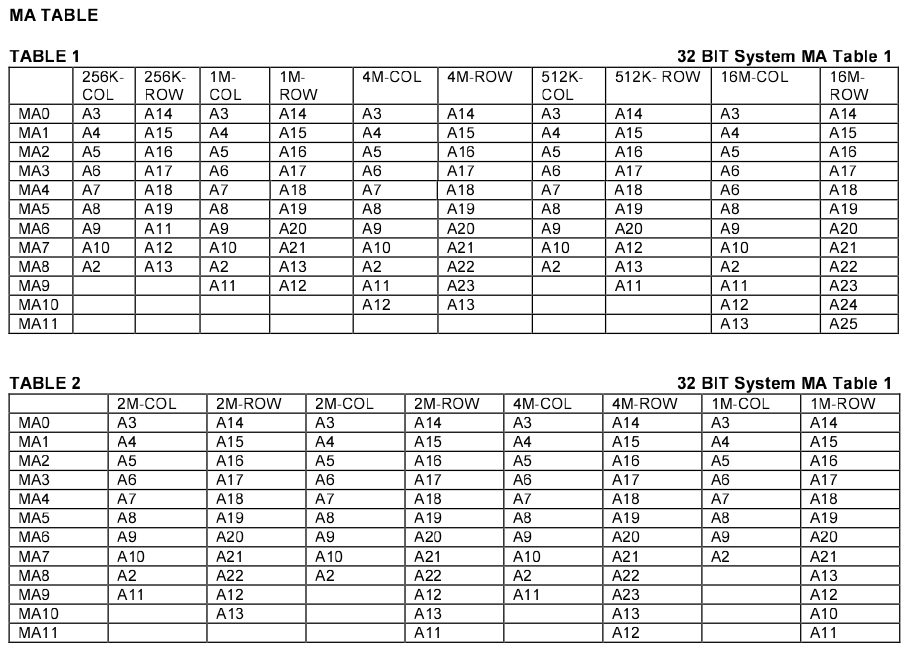

There is a different address mapping/DRAM geometry for the each memory type. Instead if we always set the largest geometry (16M - 4kx4k) we will always get the valid address for an implemented column/row pin and the data alias for an unimplemented column/row pin. The computed columns/rows number can then be used to get the DRAM chip geometry from a predefined/chipset specific mapping table.

The algorithm is repeated for each DRAM bank while the rest of the banks are disabled. Also L2 cache is still disabled and the L1 must be still in the CaR mode (reconfiguring the banks and poking addresses is destructive). Also the CaR area needs to be on the different addresses than the tested address pattern (CaR array cannot contain addresses with a single "1" bit). However both locations can be changed if some chipset would be incompatible with them.

There was also an observed situation when no DRAM was connected and the value was stuck on the bus capacitance. This can be fixed by inserting a dummy write cycle outside the testing addresses (and CaR area) so the bus capacitance will be reset.

#### L2 cache

The same one-shot algorithm can be used to detect the size of the L2 cache. The L2 cache must be forced to always hit all address are accessed and it needs to be set to the highest size with the dual bank configuration. Some chipsets need to have DRAM enabled too that the cache cycle is generated at all (no MTRR ;-) ). The always hit mode is usually a special settings of the chipset and can be used only in romstage.

First we check if address 0 is accessible. This decides if any L2 cache is installed. Then we need to check the address 4 (or any divisible by 4) which will be readable only if the cache is dual banked/interleaved. If not then we need to set the cache to be single banked.

The detection of L2 size is practically the same as for DRAM. Check the two neighboring dwords if the L2 cache is double banked (set the correct number of banks) and then just set one-hot address from the smallest to the largest expected L2 size and the first iteration which does alias is also the L2 cache size.

Finally we need to make the L2 cache coherent, so we disable L2 forced hit, set the correct timing and set the dirty/tag bits mode. Next we have to fill the cache lines right before we disable CaR mode.

This wasn't tested yet but it may be necessary to enable ROM shadow regions at this place.

#### ROM shadow

Historically the area between addresses 0xc0000-0xfffff contained option ROMs, video ROM or BIOS. However if there wasn't any option installed the precious memory space was unused. The RAM also wasted the same addresses forever hidden. This probably led to an ability to disable the ROM chip select signals and rerouting the address space to the RAM. Technically you can have a general RAM area here but realistically only data and code from option ROMs or BIOS can be shadowed here. Accessing the RAM is faster than accessing the ROM.

Chipset usually supports a locking of the entire region. Locked region will be read-only simulating the original ROM space. This limits having there a general RAM for running programs. Locking is also in a way of "everything or nothing". The shadowing ability is actually pretty useful if you want to copy a ROM image from a PCI card to have the code available even for 16bit MSDOS.

Some chipsets can also choose if the ROM access goes to ISA bus or to the actual BIOS ROM chip.

An improvement of this ROM shadow is to allow the chipset to cache the area.

This all results in a few possible modes:

* Access to ISA bus
* Access to ROM chip
* Access the copy in RAM
* Access the copy in cache

Later the SeaBIOS searches for an option ROM, so it needs to know how to unlock any assigned segment to write the copy. It will also needs to lock it before the booting.

The locking function must be implemented for each chipset, the general call `make_bios_writable()` is located in `shadow.c` of the SeaBIOS source code tree. The unlock function is called `make_bios_readonly()`.

### Postcar stage

Finally the CaR is not needed so we can dismantle it and enable the L2 cache. This stage is decompressed and then started from the RAM. Another function of the postcar stage is to prepare tables and variables for the RAM and to decompress and load the next stage: "ramstage". We can see how the CaR disabling is implemented in the vanilla coreboot [here](https://elixir.bootlin.com/coreboot/24.05/source/src/arch/x86/exit_car.S#L52).

```assembly
chipset_teardown_car:
	pop %esp

	post_code(POSTCODE_POSTCAR_DISABLE_CACHE)

	/* Disable cache. */
	movl	%cr0, %eax
	orl	$CR0_CacheDisable, %eax
	movl	%eax, %cr0

	post_code(POSTCODE_POSTCAR_DISABLE_DEF_MTRR)

	/* Disable MTRR. */
	movl	$MTRR_DEF_TYPE_MSR, %ecx
	rdmsr
	andl	$(~MTRR_DEF_TYPE_EN), %eax
	wrmsr

	/* Disable the no eviction run state */
	movl	$NoEvictMod_MSR, %ecx
	rdmsr
	andl	$~2, %eax
	wrmsr
	andl	$~1, %eax
	wrmsr

	post_code(POSTCODE_POSTCAR_TEARDOWN_DONE)

	/* Return to caller. */
	jmp	*%esp
```

As the L2 cache on 486 is different it is not completely clear where we should put L2 fill/init code. By running some experiments this code works:

```assembly
	/* fill L2 cache, twice as size? */
	movl	$0x200000, %edi
	movl	$0x300000, %ecx
	sub		%edi, %ecx
	shr		$2, %ecx
	cld
	xor		%eax, %eax
	rep		stosl	/* DF=0, up */

	invd

	/* Enable caching if not already enabled. */
	mov		%cr0, %eax
	and		$(~(CR0_CD | CR0_NW)), %eax
	mov		%eax, %cr0

	/* Ensure cache is clean. */
	invd

	movl	$0x200000, %edi
	movl	$0x400000, %ecx
	sub		%edi, %ecx
	shr		$2, %ecx
	cld
	rep		lodsl	/* DF=0, up */
```

Enabled L2 cache needs to hit every address which is erased. Next the L1 cache is invalidated (and data are lost), but this according to the Intel 486 datasheet may cause L2 cache flush. Then the L1 cache is enabled, invalidated again and then an arbitrary range of RAM is read (2x size of L2 cache is recommended).

This code is most likely highly inefficient and redundant, but it worked on the testing board ;-). If the L2 cache is not filled, the power-on values in its SRAM chips can contain incorrect informations which will (at L2 hit) be returned to the CPU (and the code will crash).

Now we shouldn't touch any cache settings or the cache will become non-coherent with RAM again. Also as we will now run from RAM L2 cache could contain the code we are running and any noncoherency could crash the code in most unexpected places.

Postcar will then find and decompress ramstage payload and thats it.

NOTICE: It is possible postcar stage could be merged to bootblock and ramstage. So we could save more space in the bios image.

### Ramstage

Finaly we are getting to the actual coreboot code. Ramstage is packed with an LZMA compression (sometimes even 50% of the original size). It will enumerate PCI bus including PCI-PCI bridges ;-), define memory ranges for BIOS e820 API (it will also use them for PCI bus enumeration). SMBIOS, PIRQ and ACPI tables can be generated too. Original coreboot supports even initial video, but we will not use it (as the code eats too much space).

Ramstage can do an initialization of some peripherals (e.g. integrated IDE, superIO). Its final operations is to load a payload, which is in our case a SeaBIOS. SeaBIOS is decompressed into segments E and F in the RAM shadow. After loading the payload ramstage will do some final chipset settings including locking the RAM shadow from writing and jumps to the payload.

### Payload/SeaBIOS

From now on the SeaBIOS code is executed. Its code in E/F segments should emulate IBM PC compatible BIOS. Coreboot payload loader system jumps to an inner function, but the SeaBIOS has a legacy reset vector code too (F000:FFF0 of 8086). We can jump to this address if we detect a warm reset from 386+ reset vector (0xFFFFFFF0) and SeaBIOS will just continue and handle warm reset.

The SeaBIOS is built automaticaly, but with a predefined configuration. We can change it in the mainboard directory in the coreboot tree `src/mainboard/*/*/config_seabios`.

We need to patch SeaBIOS code too, careful any `make clean` will reset any changes as it redo a git checkout. I've disabled the checkout call located [here](https://elixir.bootlin.com/coreboot/4.19/source/payloads/external/SeaBIOS/Makefile#L37):

```makefile
checkout: fetch
	echo "    Checking out SeaBIOS revision $(TAG-y)"
	cd seabios; git checkout master; git branch -D coreboot 2>/dev/null; git checkout -b coreboot $(TAG-y)
```

If we want to use floppy, SeaBIOS supports that, but only for QEMU. We can force the code for any hardware by making [this condition](https://github.com/coreboot/seabios/blob/ec0bc256ae0ea08a32d3e854e329cfbc141f07ad/src/hw/floppy.c#L158) be always true:

```C
    if (CONFIG_QEMU) {
        u8 type = rtc_read(CMOS_FLOPPY_DRIVE_TYPE);
        if (type & 0xf0)
            addFloppy(0, type >> 4);
        if (type & 0x0f)
            addFloppy(1, type & 0x0f);
    } else {
```

Adding this functionality into the normal SeaBIOS use case was discussed a few times, but the result is "don't want to add legacy functionality"

[Support CMOS setting outside QEMU](https://mail.coreboot.org/hyperkitty/list/seabios@seabios.org/thread/FH4WNWM63C2FFGKFXBSJM43AJ5EAM6CL/#FH4WNWM63C2FFGKFXBSJM43AJ5EAM6CL)

[Floppy drive configuration](https://mail.coreboot.org/hyperkitty/list/seabios@seabios.org/thread/TCM5FSZ3KHHI5FTRQ2CBDQKSD2U27KZU/#B3YVXN4Z6VKM3K4D36MWFAFD62HYEX45)

Also configuring the PIT counter 1 is critical. Parts of MSDOS will freeze if it receives the machine without initialized PIT. SeaBIOS [didn't do the configuration](https://github.com/coreboot/seabios/blob/ec0bc256ae0ea08a32d3e854e329cfbc141f07ad/src/hw/timer.c#L274).

```C
void
pit_setup(void)
{
    if (!CONFIG_HARDWARE_IRQ)
        return;
    // timer0: binary count, 16bit count, mode 2
    outb(PM_SEL_TIMER0|PM_ACCESS_WORD|PM_MODE2|PM_CNT_BINARY, PORT_PIT_MODE);
    // maximum count of 0000H = 18.2Hz
    outb(0x0, PORT_PIT_COUNTER0);
    outb(0x0, PORT_PIT_COUNTER0);
}
```

[This condition](https://github.com/coreboot/seabios/blob/ec0bc256ae0ea08a32d3e854e329cfbc141f07ad/src/optionroms.c#L266) expects the PCI space cannot be mapped in the first 16 MiB of the address space of the CPU.

```diff
-    if (orig == sz || (u32)(orig + 4*1024*1024) < 20*1024*1024) {
+    if ((orig == sz) || ((u32) orig < 4*1024*1024)) {
```

It is probably a good constraint so ISA space (DMA ...) doesn't collide with the PCI space. For now we can disable this requirement. Some 486 chipsets supports PCI space right after the end of RAM. If there is less than 16 MiB of RAM the test will fail. The support to enumerate the PCI addresses at the SeaBIOS compatible position is not yet implemented in the coreboot. BTW a 486 machine can easily have 4 MiB of RAM.

The important feature to add is the ability to control ROM shadow read-only function. SeaBIOS can fill option ROM regions with data from PCI option ROMs and it need to be able to write there. The set of the calls are [defined here](https://github.com/coreboot/seabios/blob/ec0bc256ae0ea08a32d3e854e329cfbc141f07ad/src/fw/shadow.c#L116):

And we need to correctly set the configuration bits in the chipset. Other chipset routines can be completely erased to save the space (or you can use some detection routines). There is no compile time definition support :-(.

Rest of the patches are not so important to describe here, they are part of the git repo.

We can set any supported hardware we will want to use in the configuration settings. However some drivers may use too much space. Some chipsets don't work with PS/2 mouse support and PS/2 mouse being disconnected. Debug asserts cause a freeze with some 32-bit applications. CDROM/DVD works, but it takes a really long time to detect a new medium.

### UMC addendum

Even though the original coreboot patch was made for FinALI chipset, the most work was done for UMC 8881/6 chipset. Doing so was a really "fun"/"frustrating" activity (chose one :-D) as there isn't any datasheet. Still I've bought a board, which turned to be faulty. The rise times on the ISA bus (including the ROM chip) were out of spec because the southbridge was most likely damaged (there is a damaged pin on the ISA bus near the 12V line).

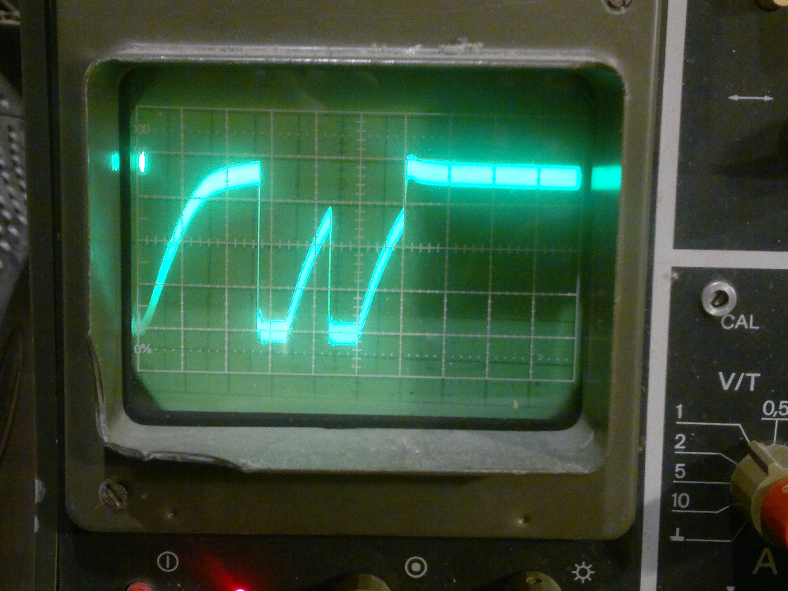

To gain at least some use from the broken board I decided to recreated a technical manual by reverse engineering the chipset. Thanks to people at vogons and retroweb I was able to put together pinout and registers of the chipset. Hacking the real hardware on a replacement board allowed me to correct some of these descriptions and model the hardware behaviour. The most important was a map between DRAM columns/rows and memory address. However there is still a lot of unknown registers. The system can boot with preset value obtained from the values set by vanilla BIOS though.

### Getting the compiler

To build anything for 486 system we need a compiler. Modern 64-bit distributions doesn't support a compilation to 32-bit output anymore. Even if they did, some crt libraries (e.g. divide functions) are already pre-compiled with too modern opcodes. This took me so long to find out that an OS bundled compiler still generates executable files with `endbr32` instruction even if `-march=i486` flag is set. Running `endbr32` instruction on a 486 causes an illegal instruction exception. (I didn't even know the instruction before the meltdown/spectre affair appeared).

We can kill two birds with one stone if we use the [buildroot project](https://buildroot.org/download.html) or the [custom 486 branch](https://github.com/pc2005cz/buildroot_486) which has already included [some 486 patches](https://github.com/pc2005cz/TheUltimate486Upgrade/tree/main/resources/buildroot.patch).

```bash
cd where_git_repositories_are_located
git clone https://github.com/pc2005cz/buildroot_486.git
```

We can add a pre-generated [buildroot .config file](https://raw.githubusercontent.com/pc2005cz/TheUltimate486Upgrade/refs/heads/main/resources/.config_buildroot) for the 486 systems or we can enable only a smaller set of packages so the cross-compiler is generated faster. The set of the enabled options can be usually changed later (some packages' builds needs to be cleaned/rebuilt first sometimes).

Buildroot packages will be described later.

```bash
make menuconfig
make
```

Buildroot will then build a compiler, all standard linux userspace application and it will pack it into a tar archive, which we can unpack directly to the hard drive. It could also build a kernel, but this would made the modifications more difficult to maintain. It is better to compile the kernel as a standalone project.

Also don't be alarmed if the build fails. It does often, you gonna need to investigate and fix which package did it though. Some packages make fail just when downloading the source tarball. The hosting servery is usually under maintenance. It suck, but the tarballs can be copied from a mirror and once a tarball is downloaded it won't be re-downloaded again for any subsequent recompilations.

If we define the path to the compiler executables we can use it to compile any external software. The compiler is integrated to the system libraries of the target distribution so it has most of the dependencies correctly set. The rest can be fixed with a [build evinronment script](https://raw.githubusercontent.com/pc2005cz/TheUltimate486Upgrade/refs/heads/main/resources/envir_buildroot_486.sh) which sets the building environment to buildroot compiler. Don't forget to set the correct path `BROOT_PATH` for the buildroot location.

### Building the coreboot

After an optional use of the [default coreboot configuration for Biostar MB-8433UUD](https://raw.githubusercontent.com/pc2005cz/TheUltimate486Upgrade/refs/heads/main/resources/.config_coreboot) we can just run these commands:

```bash
. /path_to/envir_buildroot_486.sh
make menuconfig
make
```

If the build doesn't fail we have now a flash image in `./build/coreboot.rom`. All we need now is to flash the image into a chip and boot from it. We can use a programmer or just do a hotflash. I've tried to make a programmer with XC9572 CPLD which had too much problems with noise and with different I/O voltages which taught me a valuable lesson: the best solution to a problem is usually the easiest one: I "modded" the flash chip itself with a duct tape for an easier hotflash :-D.

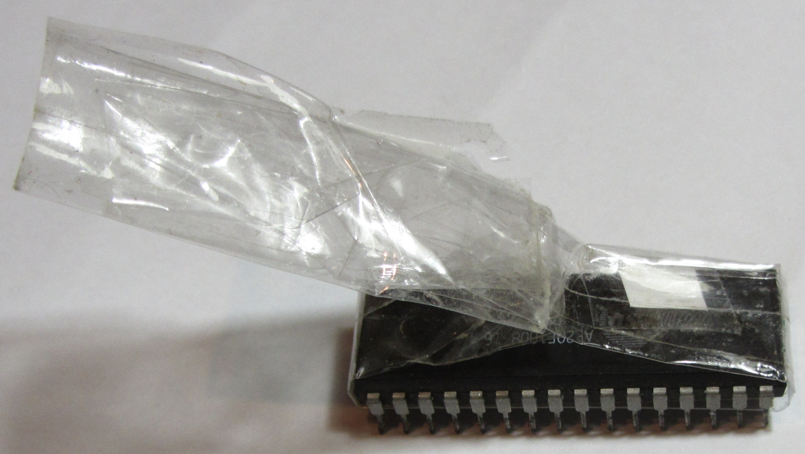

Surprisingly it works really well. The tape spreads out the pull-out force and makes the chip more accessible.

An updated board can be connected via null modem cable (COM1 set to 115200 bauds by default). The power-on register values on the most super IO chips have the COM1 port usually enabled. If not the coreboot needs to enable them earlier.

If there is some messages shown on the COM terminal, the coreboot at least tries to do something and after some time we should ideally see a boot menu on the monitor where we can select any supported boot device.

NOTICE: There is no CMOS setup, all values in CMOS are ignored and don't touched. There isn't actually a good SETUP-like application for coreboot. The nvramcui exists, but it needs API library code which is too big to fit 128 kB image. The best solution would be to write a SETUP which uses BIOS API to e.g. print on the screen.

## Preparing the drive image

If we use a small enough drive, we could use the same image under vanilla BIOS and under coreboot. A 4GB SD or CF card should work well if the sector addressing is set to LBA. The drive will also need to have a bootloader. Ideally one which can boot multiple OSes.

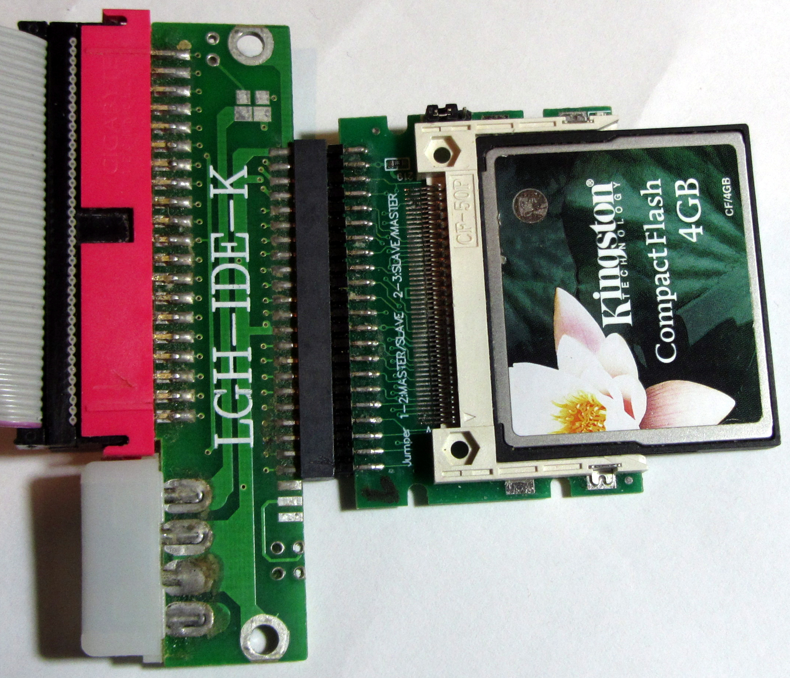

With coreboot int 0x13 implementation you can try to use IDE/SATA adapter. However it seems some of my 486 doesn't like them. They will identify the drive with errors in the name and then the drive access will freeze. Not sure why but my hypothesis is either an incompatible timing of the adapter or different voltage levels. Pre-pentium boards have the IDE signals connected via TTL 74F245 buffers and the adapter may expect CMOS drivers which are expected on modern chipsets.

### Bootloader

For some reason GRUB bootloader always crashed and rebooted when I tried to boot the system. LILO is too old and too its configuration update is too complicated if LILO is also used on the main computer. Therefore the best bootloader to use is SYSLINUX. It can have a simple text mode menu and it can boot multiple images including also MSDOS.

HDD should contain a small MSDOS partition with SYSLINUX files (including vmlinuz and System.map), [DOS Benchmark Pack](https://www.philscomputerlab.com/dos-benchmark-pack.html) and ideally a flasher. I used uniflash for entire coreboot development.

Also we should be able to create the same image for generic/multiple drives if we want to try different interfaces and adapters. For this purpose I've made a [bash script](https://raw.githubusercontent.com/pc2005cz/TheUltimate486Upgrade/refs/heads/main/resources/rootfs_builder_dangerous.sh), which generates a disk image and writes it on a specified drive.

A variable DRIVE needs to be set to your (removable) drive, careful if you make a mistake it will erase your main drive, also you need to run script with the root privileges.

This will erase an MBR of a drive, so kernel won't get confused.

```bash
dd if=/dev/zero bs=512 count=1 oseek=0 conv=notrunc of="${DRIVE}"
```

And we partition the drive to have roughly 750MB of FAT16 and the rest is ext4 for linux.

```bash
cat <<EOF | parted -a none "${DRIVE}"
mklabel msdos
unit s
mkpart primary 63s 1527679s
type 1 6
mkpart primary ext4 1527680s -1s
set 1 boot on
quit
EOF
```

We write syslinux MBR from its installed location to the drive.

```bash
dd if=/usr/share/syslinux/mbr.bin conv=notrunc of="${DRIVE}"
```

It doesn't fill entire MBR, partitions are not overwritten.

Now we patch the CHS address of the first sector of partition. It seems that was the only obstacle to make the linux created partitions to work on 486 Award BIOSes.

```bash
echo -e -n "\x01\x01\x00" | dd bs=1 count=3 oseek=$((0x1bf)) conv=notrunc of="${DRIVE}"
```

Careful, the changed partition table worked with vanilla 486 Award, but the image may fail on more modern architecture (I tried to boot the DOS on an AthlonXP board and the LBA/CHS autodetection failed).

Now we can format partitions to the required filesystems.

```bash
mkdosfs -v -F 16 "${DRIVE}1"
mkfs.ext4 -q -F "${DRIVE}2"
```

Now the funny part. You can actually make a bootable MSDOS 6.22 drive by just copying the files over. However there is a catch. The system files need to be copied with the correct order: IO.SYS as the first ever written file (first entry in root directory) and
MSDOS.SYS as the second written file. The rest of files can be copied with any order.

So we prepare the MSDOS files (or the entire filesystem) into local subdirectory, mount the partition and copy the files into it.

MSDOS partition gets mounted into `1` subdirectory:

```bash
mkdir -p ./1
mount -o noexec,fmask=111 "${DRIVE}1" ./1
cp ./files/IO.SYS ./1/		#NOTICE must be first thing copied
cp ./files/MSDOS.SYS ./1/	#NOTICE must be second thing copied
cp ./files/COMMAND.COM ./1/
```

The SYSLINUX should be installed into `boot` subdirectory with modules in `boot/bin` so let's create them:

```bash
mkdir -p ./1/boot/bin

cp /usr/share/syslinux/cpuid.c32 ./1/boot/bin
cp /usr/share/syslinux/menu.c32 ./1/boot/bin
cp /usr/share/syslinux/sysdump.c32 ./1/boot/bin
cp /usr/share/syslinux/reboot.c32 ./1/boot/bin
cp /usr/share/syslinux/pcitest.c32 ./1/boot/bin
cp /usr/share/syslinux/meminfo.c32 ./1/boot/bin
cp /usr/share/syslinux/linux.c32 ./1/boot/bin
cp /usr/share/syslinux/isolinux.bin ./1/boot/bin
cp /usr/share/syslinux/cmd.c32 ./1/boot/bin
cp /usr/share/syslinux/config.c32 ./1/boot/bin
```

Not every module is required, some are used for testing, but you'll definitely need `linux.c32` ;-).

The configuration file `syslinux.cfg` should be located in `boot` too and it's content should look like this:

```
default /boot/bin/menu.c32
prompt 0
TIMEOUT 25

MENU TITLE 486 chipsets testing

label umc
  MENU LABEL Linux UMC
  LINUX /boot/vmlinuz
  append libata.dma=0 console=ttyS0,115200,8n1 module.blacklist=pata_isapnp module_blacklist=pata_isapnp,pata-isapnp libata.force=3:pio0 initcall_blacklist=pata_isapnp,pata-isapnp root=/dev/sda2 pci=rom,assign-busses,nommconf,routeirq,biosirq,irqmask=0xffff,noacpi,pcie_scan_all,realloc,nomsi,noaer,noari,conf1 raid=noautodetect fbcon=map:0 memory_corruption_check=0

label dos
  MENU DEFAULT
  MENU LABEL DOS bench
  kernel /boot/fat16_v5.bss
```

The format is pretty simple, just a definition of two bootable configurations their names and parameters for linux boot, where we disable modern stuff.

For booting MSDOS we will need to get a standard MSDOS bootsector. It should be possible to just copy the first 512 bytes of any FAT16 image and save it into `/boot/fat16_v5.bss`. When selected as the option the SYSLINUX will just load the bootsector a execute it.

As we want to make things quick, we can just make a copy of everything we need to put on the partition and put it in `files` subdirectory. After that we can (after special care for IO.SYS and MSDOS.SYS) just use rsync:

```bash
rsync -a -H -A -X --open-noatime ./files/ ./1/
```
As everything is copied now, we can unmount the partition:

```bash
umount "${DRIVE}1"
```

And install the initial syslinux configuration:

```bash
syslinux -i -d boot "${DRIVE}1"
```

It seems changing `syslinux.cfg` or updating `vmlinuz` doesn't require to reinstall it.

Copying any software on linux ext4 partition is a similar process (mount, rsync, unmount).

The image should be now able to boot into MSDOS on Biostar MB-8433UUD or ABit AB-PB4 board with the drive set to use LBA sector addressing scheme.

### Preparing the linux

Caution: this will need a lots of space (30 GB of the free space is _recomended_).

There isn't any modern distribution to be 486 compatible, however the kernel (as of 6.3.9) still supports the CPU. We gonna need to download the kernel source:

```bash
cd where_git_repositories_are_located
git clone https://github.com/pc2005cz/linux_486.git
cd linux_486
```

Having a local git repo is useful for modification of the source codes. Also if the 486 support may be eventually removed, we will always be able to checkout an older version.

The github repo has already all the patches included, but it is always possible to use the vanilla-stable tree and apply the patches selectively. The 486 support was branched from 00d3ac724541a0661b148b16cf34fac135a4fd53 ([Linux 6.3.9](https://github.com/gregkh/linux/tree/v6.3.9)) and all patches are [located here](https://github.com/pc2005cz/TheUltimate486Upgrade/tree/main/resources/kernel.patch).

The config of the kernel can be used from [here](https://raw.githubusercontent.com/pc2005cz/TheUltimate486Upgrade/refs/heads/main/resources/.config_kernel) and the building script from [here](https://raw.githubusercontent.com/pc2005cz/TheUltimate486Upgrade/refs/heads/main/resources/mk_kernel_6.3.9_486). Don't forget to change the paths in the build script. It expects `./src_6.3.9_486` for the kernel source and it will create `./build_6.3.9_486` for the object files. It is also expecting to have the `.config` located there.

```bash
./mk_kernel_6.3.9_486
```

If the kernel sucessfully compiles, there should be `./build_6.3.9_486/_BUILD` subdirectory with finished `vmlinuz`, `System.map` and a `lib/modules` subdirectory with kernel drivers. If we copy these files into our linux and msdos partitions the 486 should be able to boot into the linux with an initial console on the first serial port `/dev/ttyS0`.

Except with vanilla BIOS some PCI cards will not work. It turns out kernel needs an IRQ routing table to get the correct INTx line for the PCI device, but few old BIOSes don't have the table implemented (maybe getting the routing is possible somehow from PCI BIOS calls). Anyway we can always go back to the kernel source and patch our own table in. There is also a problem of setting the routing itself. It needs to write configuration into the chipset registers and only some 486 chipsets are supported. So if the vanilla BIOS doesn't initialize a PCI card correctly we need to have this support included anyway.

Of course using the coreboot makes the patching of the PIRQ table into the kernel redundant as it generates PIRQ tables correctly.

#### PIRQ routing table

As we can see from [wikipedia](https://en.wikipedia.org/wiki/Peripheral_Component_Interconnect#Connector_pinout):

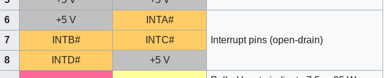

every PCI slot supports 4 lines to receive interrupts from the card. Usually a card has only a single interrupt source. However if the card uses MSI or MSI-X there virtually unlimited count of interrupt sources. No 486 supports that, but thankfully 99% of PCI compatible devices can still use legacy INTx interrupts nowadays.

A PCI device will most likely use its INTA pin to deliver an interrupt to the CPU. If all PCI devices/slots used the same INTA pin, the interrupt handler would get too overloaded in decision which device was the source of the interrupt. So in a case where there is a multiple of interrupt inputs, their connection is physically shifted for each PCI slot. For example the first PCI slot will have interrupt line A (INTA) connected to IRQ1 (and INTB -> IRQ2, INTC -> IRQ3 and INTD -> IRQ4) but the second PCI slot will have interrupt line A (INTA) connected to IRQ4 (INTB -> IRQ1, INTC -> IRQ2 and INTD -> IRQ3).

The mapping for each slot will be different for each motherboard model, so BIOS [must be aware of this mapping table](https://www.coreboot.org/Creating_Valid_IRQ_Tables). OS will then request the table and allocates the interrupts for each PCI device. With a wrong mapping the PCI device would generate an IRQ but there wouldn't be any handler to service that and the handler would wait on a different IRQ which would never occurred.

If we want to use the kernel with the old BIOS which doesn't export IRQ mapping table, we can always force the table if the autodetection fails. For example at [this place](https://elixir.free-electrons.com/linux/v6.3.9/source/arch/x86/pci/irq.c#L171):

```C
	rt = pirq_check_routing_table((u8 *)__va(pirq_table_addr), NULL);
	if (rt)
		return rt;
	printk(KERN_WARNING "PCI: PIRQ table NOT found at pirqaddr\n");
```

I've patched the kernel with manually construed mapping for [Zida 4DPS](https://theretroweb.com/motherboards/s/zida-4dps-3-x), [ABit AB-PB4](https://theretroweb.com/motherboards/s/abit-ab-pb4-rev-1.3) and [Biostar MB-8433UUD](https://theretroweb.com/motherboards/s/biostar-mb-8425uud-a). Also I've made one for [Intel Classic/PCI ED (Ninja)](https://theretroweb.com/motherboards/s/intel-classic-pci-ed-ninja), but I had the board only borrowed for a few days and I didn't test it thoroughly.

The rebuilt kernel (`vmlinuz`, `System.map` and modules) with injected mapping tables should be able to boot with an early console appearing on the first serial port.

### Playing in linux

Having linux working is a great addition to the BIOS debugging ability. We have the entire system to be accessible and with abstraction layers we can poke any controller just from the shell script.

#### Accessing the RAM

If /dev/mem API is compiled into the kernel. We can use it to read from any address. There are few program which uses it. In most distributions we can find [`memtool`](https://github.com/pengutronix/memtool), [`devmem`](https://busybox.net/downloads/BusyBox.html#devmem) or [`devmem2`](https://github.com/radii/devmem2). Also we can write our own application as `/dev/mem` is just a special file and required address is an offset to seek into.

The syntax is usually along the lines with `address` `word size` `written value`.

#### Accessing I/O ports

Similary as `/dev/mem` there is an API for IO ports (on x86) in the kernel too. I didn't found a satisfying utility, so I wrote [my own](https://github.com/pc2005cz/portyr). Mechanism is basically the same (offset = port address). Alternatively the tool can directly use out/in instructions (it must be permitted with `ioperm()` call though).

#### Accessing PCI config space

We can use `/dev/port` to access PCI. Or we can use `setpci`. The syntax need to identify the device (`-s bus:device.function`), the optional type of the access method (`-A`) and the config register address with the word size (`b`,`h`,`l`) and optionally the new value.

```bash
setpci -A intel-conf1 -s 0:0x10.0 0x50.b=0x42
```

The bus/device/function values for each device can be obtained with `lspci` command. This is a very useful program as we can use it to dump register space and _borrow_ the UMC chipset configuration settings from the vanilla BIOS.

### Speed up

The integrated IDE of UMC PCI chipset is really slow. It seems to be connected via 74F245 buffer directly from the ISA bus. The chipset will probably multiplexes between datapin belonging to ISA and to IDE. The bandwidth is shared and likely result is the both buses are slow.

FinALI is worse though, it multiplexes the IDE bus with PCI :-P.

The top speed of the UMC IDE in linux is around 2.10MB/s

```bash
cat /dev/sda | pv > /dev/null
 109MiB 0:00:50 [2.14MiB/s]
 111MiB 0:00:51 [2.05MiB/s]
 113MiB 0:00:52 [2.08MiB/s]
 115MiB 0:00:53 [2.19MiB/s]
 117MiB 0:00:54 [2.18MiB/s]
 119MiB 0:00:55 [2.15MiB/s]
```

```bash
time dd if=/dev/sda bs=512 count=100000 of=/dev/null
100000+0 records in
100000+0 records out
real    0m 36.30s
user    0m 7.63s
sys     0m 27.12s
```

As we have a modern BIOS implementation, we can use bigger and faster drives to lower the latency (spoiler: it won't make much of the difference).

#### PATA-SATA adapter

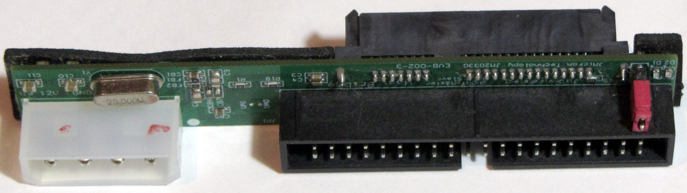

If we own this kind of adapter we can use it to connect any SATA drive to our coreboot motherboards. This will also allow us to have bigger drives as IDE/PATA drives ended with smaller capacities than current SATA drives (of course only if the OS supports it).

This can lead to situation where we can boot linux from a drive like this:

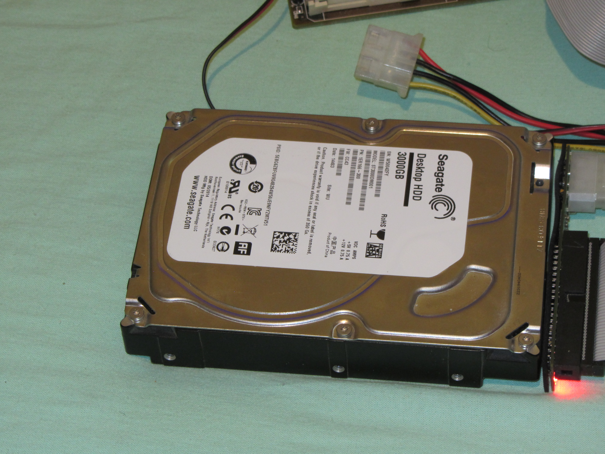

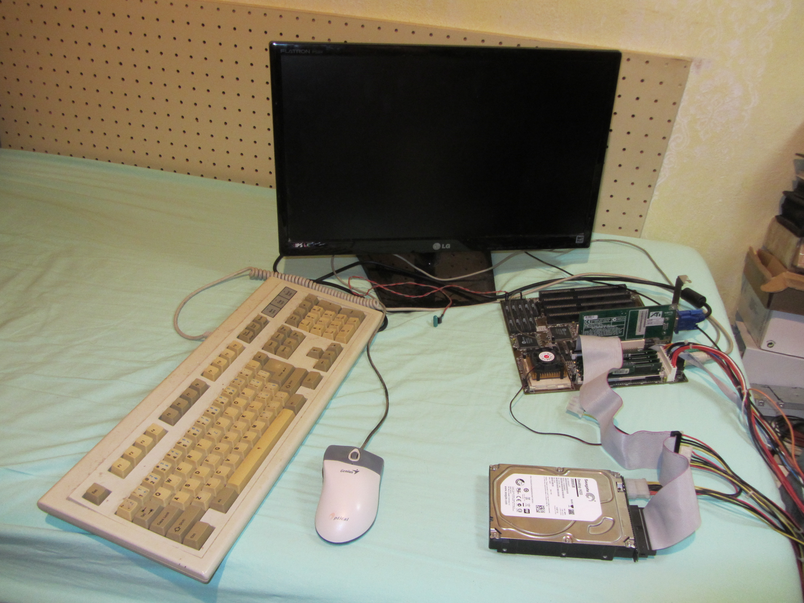

##### Exceptions

On [Abit AB-PB4 board](https://theretroweb.com/motherboards/s/abit-ab-pb4-rev-1.3) there is a problem, that even with the seabios the PATA-SATA adapter connected drive may fail to boot. Sometimes the device is detected but its identification string is returned damaged and the following accesses fail, sometimes even the identification fails.

[Biostar MB-8433UUD](https://theretroweb.com/motherboards/s/biostar-mb-8425uud-a) worked from the start. Maybe the failures on other board is caused with weaker I/O drivers/buffers, which don't have voltage levels compatible with the modern adapter chip? It is still a mystery.

#### PCI IDE adapter

If the integrated IDE controller is slow, let's use an external PCI IDE card.

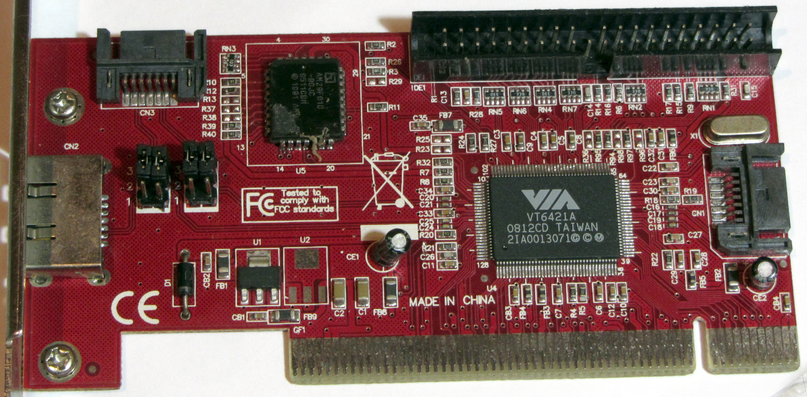

A funny fact: this card has a fake ROM flash. According to the [VIA 6421A datasheet](https://archive.org/details/bitsavers_viaTechnolTARAIDControllerRev1.020081014_490580/page/n11/mode/2up):

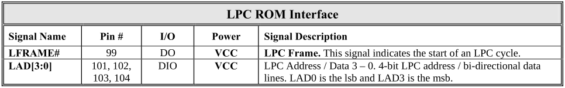

The ROM should be stored in LPC flash, but the chip is marked as parallel flash with a datecode before LPC was even invented :-D.

With ROM is being unavailable there may be some limitations of adapter's features (e.g. software raid).

After connecting the drive via native SATA, we can read the drive up to 9.1MiB/s:

```bash
cat /dev/sda | pv > /dev/null
 621MiB 0:01:04 [8.85MiB/s]
 630MiB 0:01:05 [9.15MiB/s]
 639MiB 0:01:06 [9.12MiB/s]
 648MiB 0:01:07 [8.78MiB/s]
 657MiB 0:01:08 [9.20MiB/s]
 666MiB 0:01:09 [9.11MiB/s]
```

```bash
time dd if=/dev/sda bs=512 count=100000 of=/dev/null
100000+0 records in
100000+0 records out
real    0m 15.83s
user    0m 3.44s
sys     0m 12.30s
```

#### PCI USB card

SeaBIOS supports boot via USB flash too. If we put a USB controller card into the machine we can boot any mass storage device. Ideally the compatibility should be so good that we can boot from something like this:

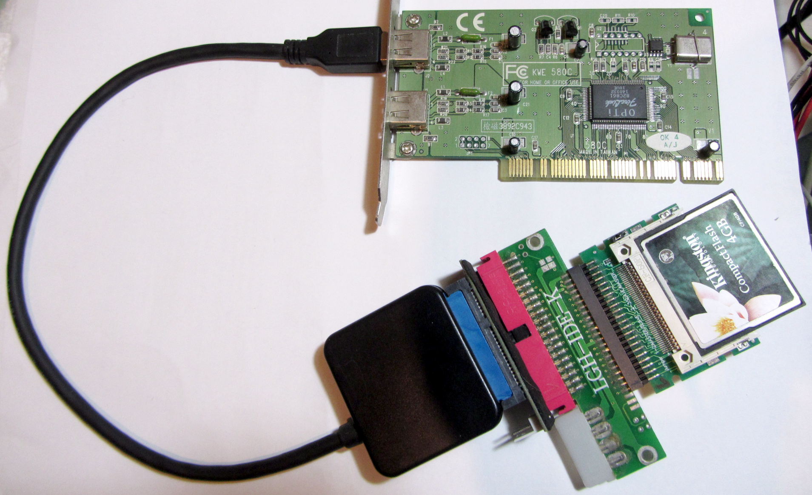

Sadly it seems the SeaBIOS timeouts with waiting on USB controller, so booting is not possible yet. Maybe it is caused by interrupt setup, but I wasn't able to find the solution. Both OHCI and UHCI drivers doesn't work. When the kernel boot is done and drivers are loaded, the USB works fine.

##### OPTi Firelink, USB 1.1 OHCI

OPTi Firelink PCI card is based on [OPTi 82C861 chip](https://theretroweb.com/chips/4713#docs).

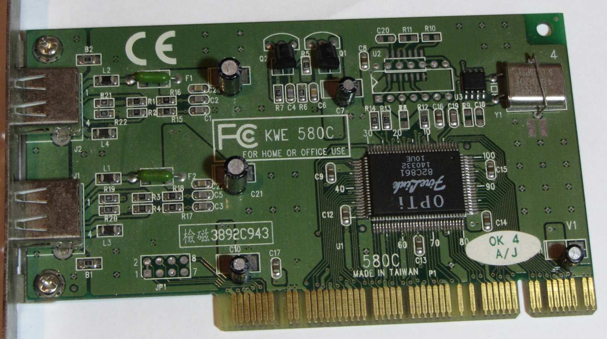

Maximum attained speed is:

```bash
cat /dev/sdb | pv > /dev/null
89.8MiB 0:01:34 [ 954KiB/s]
90.8MiB 0:01:35 [ 984KiB/s]
91.7MiB 0:01:36 [1006KiB/s]
92.6MiB 0:01:37 [ 945KiB/s]
```

```bash
time dd if=/dev/sdb bs=512 count=100000 of=/dev/null
100000+0 records in
100000+0 records out
real    0m 51.62s
user    0m 4.08s
sys     0m 16.52s
```

##### VIA VT6212L, USB 2.0 (UHCI+EHCI)

This [VIA VT6212L](https://theretroweb.com/chips/4482#docs) based card has USB 2.0 (EHCI) and USB 1.1 (UHCI) controller. We can benchmark both just by having the other driver disabled.

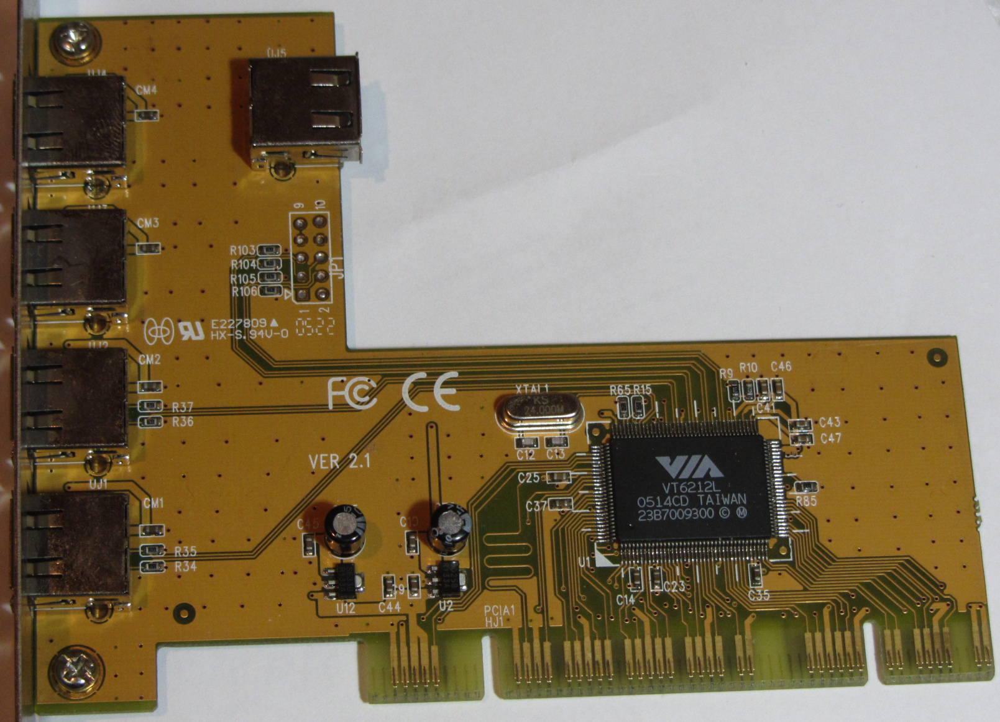

UHCI (1.1) benchmark:

```bash
cat /dev/sdb | pv > /dev/null
10.0MiB 0:00:12 [ 819KiB/s]
```

```bash
time dd if=/dev/sdb bs=512 count=100000 of=/dev/null
100000+0 records in
100000+0 records out
real    0m 58.40s
user    0m 3.78s
sys     0m 16.71s
```

It seems UHCI has a slower transfer rate. That matches the historical observation the UHCI controller specification was less efficient than OHCI controller specification.

EHCI (2.0) benchmark:

```bash
cat /dev/sdb | pv > /dev/null
 166MiB 0:00:34 [4.67MiB/s]
 172MiB 0:00:35 [5.11MiB/s]
 176MiB 0:00:36 [4.89MiB/s]
 181MiB 0:00:37 [4.55MiB/s]
```

```bash
time dd if=/dev/sdb bs=512 count=100000 of=/dev/null
100000+0 records in
100000+0 records out
real    0m 36.28s
user    0m 6.37s
sys     0m 29.87s
```

#### Even faster!

Having a modern PCI USB or SATA controller is fine, but these are now getting older and older. Why limit ourselves to the old bus if there already exists a more modern one. And thanks to the modern BIOS implementation we can actually do that!

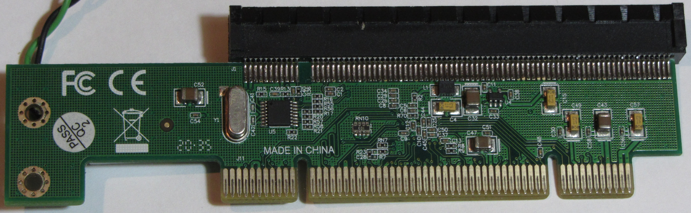

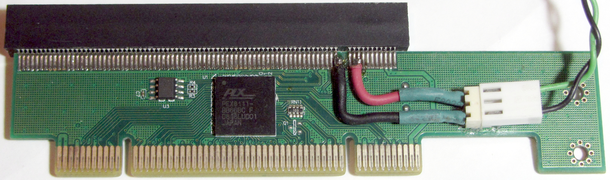

This card works as a virtual PCI-PCI bridge with one side having the old PCI bus and the other side having the PCIe link. On the protocol level there is almost no difference between PCI and PCIe so any data transfer can be just translated between both interfaces. According to the [PEX8111 datasheet](https://web.archive.org/web/20240912191629/https://www.digchip.com/datasheets/download_datasheet.php?id=7369774&part-number=PEX8111-AA66FBCF) the chip can work both ways (creating a PCI slot on a PCIe machine), but this functionality is disabled by the card wiring (there are reversed cards on the market too).

If we plug the PXE8111/2 card into 486, it ... will not work. Actually some other PCI cards also may not work. These will require 3.3V supply rail, however the most of the 486 boards doesn't have 3.3V pins implemented. The solution is *easy*, we can just solder an external 3.3V power source. This will add the 3.3V capability only to a single PCI slot. I strongly recommend to measure the 3.3V pins are _really_ not connected to anything.

Now we can try the most modern devices, so let's try a PCIe SATA controller card.

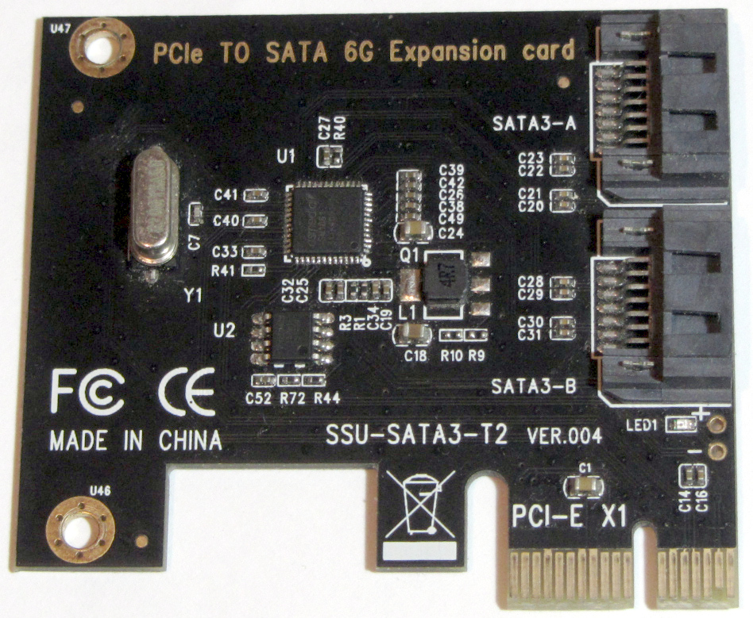

and the resulting benchmark:

```bash
cat /dev/sda | pv > /dev/null
 155MiB 0:00:16 [9.07MiB/s]
 165MiB 0:00:17 [9.17MiB/s]
 173MiB 0:00:18 [8.76MiB/s]
 183MiB 0:00:19 [9.29MiB/s]
 192MiB 0:00:20 [9.48MiB/s]
 201MiB 0:00:21 [8.84MiB/s]
```

```bash
time dd if=/dev/sda bs=512 count=100000 of=/dev/null
100000+0 records in
100000+0 records out
real    0m 20.62s
user    0m 3.95s
sys     0m 16.14s
```

It is surprisingly slow, PCI bus generally should be faster. However as UMC is from around time when PCI was invented, it will probably don't have all the optimizations. IBC (southbridge) has to arbitrate between PCI and ISA too. I could be just that linux on 486 has too big overhead to read the drive faster.

##### Vanilla BIOSes

The PCI/PCIe adapter can be used with vanilla Biostar BIOS too. If the BIOS doesn't like the card (too large BAR, too modern API of the option ROM) it will often disable the PCI/PCIe bridge altogether (and leave the devices _behind_ the bridge in inconsistent configuration). Linux can fix this by re-enumerating the PCI system, the patch is included [in the patchset](https://github.com/pc2005cz/TheUltimate486Upgrade/tree/main/resources/kernel.patch).

```diff
@@ -728,6 +888,14 @@ static struct chipset early_qrk[] __initdata = {
+       { PCI_VENDOR_ID_SI, PCI_DEVICE_ID_SI_496,
+         PCI_CLASS_BRIDGE_HOST, PCI_ANY_ID, 0, my_486_bus_num_rescan},
```

```C
static void __init _bus_reset(u8 b)
{
	for (u8 d=0;d<32;d++) {
		for (u8 f=0;f<8;f++) {
			u32 dvid;
			u8 hdr;

			//load DID VID
			dvid = read_pci_config(b, d, f, 0);
			if ((dvid == 0x00000000) || (dvid == 0xffffffff)) {
				//nothing, skip
				continue;
			}

			//get header type
			hdr = read_pci_config_byte(b, d, f, 0xe);
			if ((hdr & 0x7f) == 1) {
				//bridge header, do bridge

				//primary bus number
				write_pci_config_byte(b, d, f, 0x18, 0xff);

				//secondary bus number
				write_pci_config_byte(b, d, f, 0x19, 0xff);

				//subordinate bus number, set to
				write_pci_config_byte(b, d, f, 0x1a, 0xff);
			}

			if (!(hdr & 0x80)) {
				//not multifunction, skip nonzero rest
				//expects nonzero multifunction bit 7 == 1
				break;
			}
		}
	}
}

static u8 __init _bus_depth_set(u8 b, u8 next)
{
	if (next >= 250) {
		pr_info("PCI fixup bus num overflow\n");
		return next;
	}

	_bus_reset(b);

	for (u8 d=0;d<32;d++) {
		for (u8 f=0;f<8;f++) {
			u16 vid, did;
			u8 hdr;

			//load VID
			vid = read_pci_config_16(b, d, f, 0);
			if ((vid == 0x0000) || (vid == 0xffff)) {
				//nothing, skip
				continue;
			}

			//load DID
			did = read_pci_config_16(b, d, f, 2);

			//get header type
			hdr = read_pci_config_byte(b, d, f, 0xe);
			if ((hdr & 0x7f) == 1) {
				//bridge header, do bridge
				u8 next_new;

				//primary bus number
				write_pci_config_byte(b, d, f, 0x18, b);

				//secondary bus number
				write_pci_config_byte(b, d, f, 0x19, next);

				pr_info("PCI fix scan %04x:%04x %2u:%02u.%1u -> %2u, next:%2u\n",
					vid, did,
					b, d, f,
					next,
					next+1
				);

				next_new = _bus_depth_set(next, next + 1);

				//subordinate bus number, set to
				write_pci_config_byte(b, d, f, 0x1a, next_new - 1);

				next = next_new;
				// return next_new;
			}

			if (!(hdr & 0x80)) {
				//not multifunction, skip nonzero rest
				//expects nonzero multifunction bit 7 == 1
				break;
			}
		}
	}

	return next;
}

static void __init my_486_bus_num_rescan(int bus, int slot, int func)
{
	pr_info("486 bus num rescan (early-quirks.c)\n");
	_bus_depth_set(0, 1);
}
```

If the `bus` settings is left with inconsistent values the linux kernel re-enumeration would fail to find devices. The patch will find all PCI-PCI bridges and devices and it will then reset the `bus` number to a deterministic value, which is understandable in the PCI re-enumeration code. Using any PCIe card (behind the bridge) before the linux re-enumerated the PCI system is obviously not possible.

##### Outside Biostar motherboard

This is what started UMC reverse engineering project. If we try to use PCI/PCIe adapter with a card with busmaster capability in any of non-UMC chipsets these chipsets will freeze.

When developing a PCI host there is a risk to make a fatal mistake by assuming a bridge doesn't have the instant control between primary and secondary sides and it may already be servicing a request, which under some conditions _must_ be finished. If there is also another request which must be finished on the host side the host side may freeze in a deadlock (assuming ~2010 PCIe/PCI bridge implements a valid specification ... there _are_ some erratas for a newer versions of the PEX8xxx chip).

Well Intel, ALI and SiS developers have made this mistake in 90s (and Intel being also the initial developer of PCI specification :-D). Tested boards [Zida 4DPS](https://theretroweb.com/motherboards/s/zida-4dps-3-x) (with SiS 496NU/497NV chipset), [ABit AB-PB4](https://theretroweb.com/motherboards/s/abit-ab-pb4-rev-1.3) (FinALI) and [Intel Classic/PCI ED Ninja](https://theretroweb.com/motherboards/s/intel-classic-pci-ed-ninja) (Intel 420EX) will freeze [at this code](https://elixir.free-electrons.com/linux/v6.3.9/source/drivers/ata/libahci.c#L760):

```C
	/* enable FIS reception */
	tmp = readl(port_mmio + PORT_CMD);
	tmp |= PORT_CMD_FIS_RX;
	writel(tmp, port_mmio + PORT_CMD);

	/* flush */
	readl(port_mmio + PORT_CMD);
```

The MMIO register on a PCI device is first requested to read, then it is written and when it is requested to read back (all data should be flushed) the system will freezes. We can actually measure the address pins of the CPU and get the correct address of the MMIO register in a PCI BAR.

Some of the code may be fixed by creating a workaround. We can insert a dummy I/O port read between these MMIO access instructions, but it can be only fixed so far. If a bus master function is enabled (PCI device will start to write data to the host on its own) the freeze will always eventually occur.

The specific implementation and corner case may differ between different manufacturers, but the result is same: frozen bus as CPU is retrying to access the register and is failing to do so. Actually it was possible to unfreeze the bus for a short time period by forcing the CPU to backoff the bus (I think shorting /BOFF signal to ground). This would probably add a time to flush the data from the bridge. It could be possible to somehow monitor the bus with CPLD/FPGA and un-stalling the bus if collision is detected. Multiple shorting of the BOFF pin cause a fatal system crash (probably a bad timing specification of a screwdriver :-D).

Actually it seems at least SiS tried to fix the issue as seen in the chapter ["2.3.9. CPU Back off support for PCI Bus PCI-to-PCI Bridge" of the datasheet](https://theretroweb.com/chipset/documentation/4967-2-649447c6a7c50999895435.pdf) (on the page 32):


If the fix is working was not tested as the purple/pink sections of the datasheets are implemented only for "PR" (maybe but improbably "OR" too) revision of the chipset and I didn't own the board with this revision (when I was testing that) and also the pins used for CPU backoff are muxed with additional DRAM row address strobe signals and it is highly probable most motherboard manufacturers will opt for more memory than for the fixed PCI.

[FinALI datasheet](https://theretroweb.com/chipsets/174#docs) doesn't mention the bug at all so maybe they weren't even aware of that? (but the chipset was manufactured even in the year 2006!

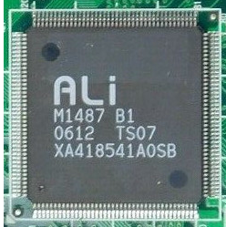

Also it seems there are two revisions (A1 vs B1) of the FinALI southbridge chip (the one which does the PCI bus arbitration) and I have a board with the older one. Maybe the newer revision has this bug somehow fixed.

[Intel datasheet for Intel 420EX Aries](https://theretroweb.com/chipset/documentation/intld030-1-253-64b53b2e24669230973923.pdf) a chapter 4.4.1 "PSC Supports Other PCI Bridges" on the page 103:

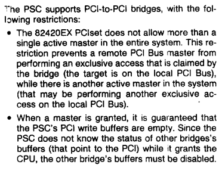

just states it doesn't support more than 1 PCI bus master, which practically excludes most of the modern use cases of PCI-PCI bridges. I wonder if pentium chipsets had the same bug too. The board was borrowed so I didn't test many things, but it froze nonetheless.

Also my Biostar MB-8433UUD board has a fairly late revision of the chipset (ETS/DYS) and previous revisions may had this bug also *included*. The tests from other owners would be appreciated ;-).

Other chipset manufacturer PCI validity was not tested but I would suspect some will also have the same problem.

Another interesting thing is the UMC is PCI oriented chipset whereas the rest are VLB oriented chipsets. UMC northbridge requests the PCI bus from the southbridge (which does the PCI arbitration) in the same way as any general PCI device would have to do. It may be possible this topology created enough situations which led to a more correct implementation. This could also mean VLB oriented chipsets will also probably have the bug whereas PCI oriented chipsets could be OK.

#### Other PCI(e) cards

With working modern BIOS, PCIe bridge and an ability to add 3.3V supply almost any PCI(e) card can be used. I didn't make most of the test outside just posting but here is a partial list:

* USB 1.1 PCI card (Opti chipset)
* USB 2.0 PCI card (VIA 6212L chipset)
* Various Realtek RTL8139D 10/100M ethernet PCI card
* 3com 10/100 ethernet PCI card with iPXE chip
* Adaptec SCSI PCI card, option ROM required PIRQ table settings
* Compaq Smart Array 221 Controller PCI, missing in subsequent reboots, fails (well it's a classical compaq compatibility with standard PC)
* Atheros PCI 802.11b wifi PCI card
* Weitek Power 9100 GPU works in MSDOS :-O
* Different SVGA PCI cards
* SATA PCIe controller
* ATI RAGE XL graphic card

But one type of the card comes to mind (and subtle references were posted during the last year on the retroweb discord >-D). According to Vogons forum threads ["Fastest PCI graphics card in a 486"](https://www.vogons.org/viewtopic.php?t=27710) or ["Modern graphics on a 486"](https://www.vogons.org/viewtopic.php?t=33879) the best card for 486 is from around GeForce2/4...

Well not anymore! GPU cards, which are supported in the linux, have the source code, therefore they can be compiled for any architecture.

I increase the bar up to AMD Radeon RX460

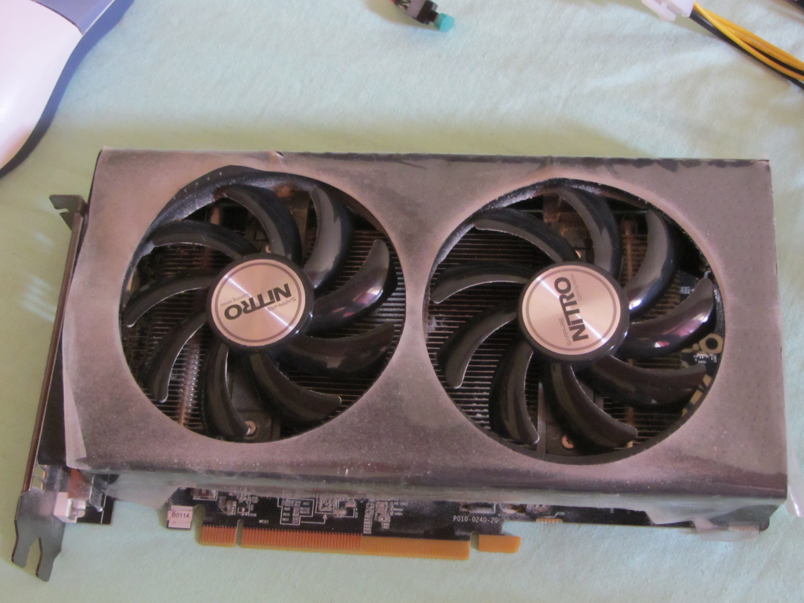

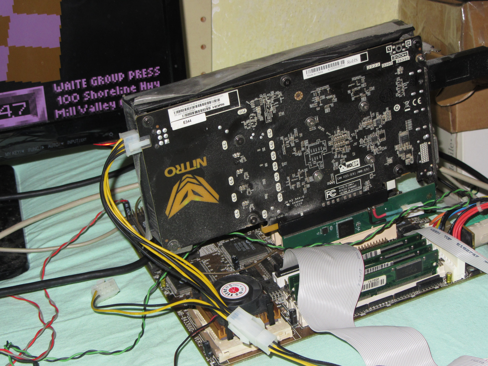

Only limitation is I don't have a newer GPU, but if somebody wants to increase the bar with lets say 2024's Radeon RX 7900 XT I say go for it :-D.

This applies to linux as windows drivers are closed source and mostly to AMD GPUs as nvidia has a closed source drivers for linux too and nouveau is most likely suboptimal.

## Graphics with 486

OK let's back up a little. If we have a GPU contest now we should start from the bottom.

The SeaBIOS should generally support any video BIOS, but there may be limitations. First the SeaBIOS doesn't support ISA bus completely. If we want to see the video from ISA card, we need to change video BIOS search algorithm.

Originally video BIOS was located in segment C (0xc0000), usually up to 32kiB (up to address 0xc8000). Modern video BIOSes can be easily 64kiB and are located in PCI region space. The best approach of option ROM scan is to test PCI devices first and then check the ISA segment C region. If a PCI video card is found (and possibly if CMOS settings allows its use as a primary card), the chipset needs to switch the C segment to be a RAM shadows and copy the option ROM from the video card there. If no PCI video is found (or if CMOS disables it) then chipset needs to switch segment C to point to ISA space and search the option ROM there. After that it can also make a copy into the shadow RAM. SeaBIOS will probably need to be patched to be aware of different sizes of shadow regions for each different chipsets (this was only tested on UMC chipset).

### SeaBIOS bugs

No so fast. It seems there is a hidden bug somewhere or maybe the BIOS implementation is so modern that some of the tests crashes. The crashes are also dependent between different video cards, which means there may be multiple bugs.

Some applications which use VBE routines will just crash, there are almost impossible to debug as MSDOS doesn't have any memory protection and any application crash will crash the entire system. Also it doesn't help the application (for example Quake) starts in 16bit mode and then it jumps or even decompress more binary into 32-bit protected mode. It is almost impossible to disassemble even in [ghidra](https://ghidra-sre.org/). Observed initialization of the program shows it will usually copy incorrect data to a wrong place and it will eventually jump there triggering an invalid operation. Programs with CWSDPMI DPMI host can be fixed by using the newest version of the DPMI driver (e.g. Quake benchmark). But the bug is just hidden, because the vanilla BIOS usually works flawlessly in the same configuration.

It also seems the VBE implementation in PCIe GPUs is somehow bugged itself and slower (which is more important).

With this spoken we can compare some measurements:

!include ./build/dos_bench_embed.md

Surprisingly PCIe cards doesn't have the best score in the most tests. Also lots of tests on PCIe have the same score between themselves. This may be possible because of some "clever" VGA transfer grouping which limits the bus? The PCI-PCIe bridge also has an internal latency.

The PCIe seems to have some bugs in VBE implementations and/or there is a bug in the SeaBIOS. Especially Chris’s 3D for VBE (640x480) shows some different bugs (silent crash, fail with an error the resolution is not supported, runs with chopped lines). PCPlayer 640x480 with HD5450 has some noise on top and the bottom bars. It may be possible something overflows somewhere.

REst of the tests may be added in the future.

Quake benchmark (DOS Benchmark Pack) running from 3TB drive:

```{=html}
<iframe width="50%" height="50%" src="https://www.youtube.com/embed/IvA7IXpEBAc" title="The Ultimate 486 Upgrade: Quake benchmark running from 3TB drive" frameborder="0" allow="accelerometer; autoplay; clipboard-write; encrypted-media; gyroscope; picture-in-picture; web-share" referrerpolicy="strict-origin-when-cross-origin" allowfullscreen></iframe>
```

```{=latex}
\href{https://youtu.be/IvA7IXpEBAc}{\includegraphics{images/yt_IvA7IXpEBAc.jpg}}
```

DOOM (DOS Benchmark Pack):

```{=html}
<iframe width="50%" height="50%" src="https://www.youtube.com/embed/AbkFJxC_FWk" title="The Ultimate 486 Upgrade: DOS Benchmark Pack, DOOM" frameborder="0" allow="accelerometer; autoplay; clipboard-write; encrypted-media; gyroscope; picture-in-picture; web-share" referrerpolicy="strict-origin-when-cross-origin" allowfullscreen></iframe>
```

```{=latex}
\href{https://youtu.be/AbkFJxC_FWk}{\includegraphics{images/yt_AbkFJxC_FWk.jpg}}
```

Anyway the best video test I've seen is a 256 bytes (!) demo called [Wolf](https://www.pouet.net/prod.php?which=3396).

```{=html}
<iframe width="50%" height="50%" src="https://www.youtube.com/embed/MKfTCFH9wY0" title="The Ultimate 486 Upgrade: 256 bytes demo Wolf" frameborder="0" allow="accelerometer; autoplay; clipboard-write; encrypted-media; gyroscope; picture-in-picture; web-share" referrerpolicy="strict-origin-when-cross-origin" allowfullscreen></iframe>
```

```{=latex}
\href{https://youtu.be/MKfTCFH9wY0}{\includegraphics{images/yt_MKfTCFH9wY0.jpg}}
```

### Linux

Well none of this is relevant in linux which uses targeted drivers and not generic VBE calls (except for vesafb and only at boot, I think).

If we have an AMD Radeon and we want to use it fully, we need to compile a driver in the kernel and an userspace driver too.

Modern AMD GPUs have two kernel drivers (with a slight overlay): `radeon` and `amdgpu`. The first one should support almost everything between around 7xxx and early GCN. The second one (amdgpu) should support anything with GCN architecture onward. This usually causes the driver to take really a lot of space. We can shrink the size of the driver by commenting any unused chips in the switch case section in [`radeon_asic_init()`](https://elixir.free-electrons.com/linux/v6.3.9/source/drivers/gpu/drm/radeon/radeon_asic.c#L2332):

```C
	switch (rdev->family) {
	case CHIP_R100:
	case CHIP_RV100:
	case CHIP_RS100:
	case CHIP_RV200:
	case CHIP_RS200:
		rdev->asic = &r100_asic;
		break;
	case CHIP_R200:
	case CHIP_RV250:
	case CHIP_RS300:
	case CHIP_RV280:
		rdev->asic = &r200_asic;
		break;
	case CHIP_R300:
	case CHIP_R350:
	case CHIP_RV350:
	case CHIP_RV380:
		if (rdev->flags & RADEON_IS_PCIE)
			rdev->asic = &r300_asic_pcie;
		else
			rdev->asic = &r300_asic;
		break;
```

Tables which are not referenced will be optimized out (removed) along with unused code parts.

I patched some parts of the GPU system to not use any cache, as it seems 486 chipset doesn't cache nor prefetch PCI space. That could be wrong, but the patched code works. For example in [`radeon_bo_create()`](https://elixir.free-electrons.com/linux/v6.3.9/source/drivers/gpu/drm/radeon/radeon_object.c#L180):

```C
#elif defined(CONFIG_X86) && !defined(CONFIG_X86_PAT)
	/* Don't try to enable write-combining when it can't work, or things
	 * may be slow
	 * See https://bugs.freedesktop.org/show_bug.cgi?id=88758
	 */
#ifndef CONFIG_COMPILE_TEST
#warning Please enable CONFIG_MTRR and CONFIG_X86_PAT for better performance \
	 thanks to write-combining
#endif

	if (bo->flags & RADEON_GEM_GTT_WC)
		DRM_INFO_ONCE("Please enable CONFIG_MTRR and CONFIG_X86_PAT for "
			      "better performance thanks to write-combining\n");
	bo->flags &= ~(RADEON_GEM_GTT_WC | RADEON_GEM_GTT_UC);
```

We should always set "uncached" flag.

```C
bo->flags |= RADEON_GEM_GTT_UC;
```

Uncached variants should be used in `radeon_ttm_io_mem_reserve()` too. The rest are most likely debugging asserts if any. Attached patches should work.

AMDGPU driver is architectonicaly very similar. It may use 64-bit atomic access variables. IMO these can be emulated by disabling the interrupts so we shouldn't worry (some CPU architectures may have this unimplemented).

```{=html}
<iframe width="50%" height="50%" src="https://www.youtube.com/embed/eMYgJ9gu71Y" title="The Ultimate 486 Upgrade: Neofetch with AMD RX460" frameborder="0" allow="accelerometer; autoplay; clipboard-write; encrypted-media; gyroscope; picture-in-picture; web-share" referrerpolicy="strict-origin-when-cross-origin" allowfullscreen></iframe>
```

```{=latex}
\href{https://youtu.be/eMYgJ9gu71Y}{\includegraphics{images/yt_eMYgJ9gu71Y.jpg}}
```

These drivers only form a hardware abstraction layer (DRM) and a framebuffer. The main linux rendering engine called [Mesa3D](https://www.mesa3d.org/) is implemented in the user space. We need to recompile the buildroot with Xorg + Mesa3D and companion libraries included. Patches and configuration are available, but it may need some script hacking when being reused for a newer buildroot version.

Funny fact: Mesa3D does automatically enable SSE for compilation, which needs to be disabled and changed to i486 architecture level. The same applies for the pixman library for bitmap manipulations. Xorg server also intensively uses the `cpuid` instruction which excludes all pre-CPUID processors from our experiments (future tests are too slow for Am5x86-133 anyway).

After both kernel and buildroot rebuilds we can try to start the X server. I strongly recommend to include the kernel driver for the GPU in the modprobe blacklist, so the driver will load only manually and not during boot. The Xorg server should be also disabled at the boot. The 486 with the graphic system should have at least 64 MB of RAM or the Xorg will eat entire memory and the linux will freeze/swaps to death/crash. Especially if out of memory event kills something important. I did testing with 128 MB of RAM and the free space of the RAM was tight. You can also enable swap, it will be slow with integrated IDE.

The most of the tests were done with ATI Radeon HD5450 as my RX460 was deemed too precious to be put into an ancient 486 machine for a long duration. Also I needed a GPU to work/build/install :-D. AMDGPU driver finds the RX460 and enables the framebuffer however it seems too laggy to use and there are still problems with cacheable region definitions.

```bash
modprobe radeon
Xorg -retro -config /etc/X11/xorg.conf > /dev/null 2> /dev/null &
export DISPLAY=:0
export vblank_mode=0
xeyes
```

The programs should be started each after some time. Xorg can be run in the background but it will take a minute it even initialize. The variable `DISPLAY` is needed for the GUI applications to know where the X server is located. The variable `vblank_mode` disable VSYNC so we can observe the true maximal FPS >-D.

If everything goes right we should see in like 2 minutes eyes watching the mouse pointer. There is no window management so all applications will have the default window size.

That's boring let's run:
```bash
glxgears -info
```

Let's see the entire boot sequence:

```{=html}
<iframe width="50%" height="50%" src="https://www.youtube.com/embed/OAFs6M2Sl7k" title="The Ultimate 486 Upgrade: GLXgears" frameborder="0" allow="accelerometer; autoplay; clipboard-write; encrypted-media; gyroscope; picture-in-picture; web-share" referrerpolicy="strict-origin-when-cross-origin" allowfullscreen></iframe>
```

```{=latex}
\href{https://youtu.be/OAFs6M2Sl7k}{\includegraphics{images/yt_OAFs6M2Sl7k.jpg}}
```

And the result log looks like that:

```
GL_RENDERER   = AMD CEDAR (DRM 2.50.0 / 6.3.9-retro+)
GL_VERSION    = 4.5 (Compatibility Profile) Mesa 23.2.1
GL_VENDOR     = Mesa
...
155 frames in 5.0 seconds = 30.920 FPS
155 frames in 5.0 seconds = 30.838 FPS
156 frames in 5.0 seconds = 30.995 FPS
155 frames in 5.0 seconds = 30.899 FPS
156 frames in 5.0 seconds = 31.016 FPS
154 frames in 5.0 seconds = 30.659 FPS
156 frames in 5.0 seconds = 31.160 FPS
154 frames in 5.0 seconds = 30.700 FPS
```

A classical test, it should show the FPS as it goes. It will also log the openGL capabilities. It is funny to see having a OpenGL 4.5 GPU to run in 486 system. The default window size can run up to 30 FPS which is impressive. The full screen (`-fullscreen`) on 16:9 monitor actually runs faster as there is probably smaller amount of the visible polygons.

```{=html}
<iframe width="50%" height="50%" src="https://www.youtube.com/embed/N8oJyh2pmJQ" title="The Ultimate 486 Upgrade: Fullscreen glxgears" frameborder="0" allow="accelerometer; autoplay; clipboard-write; encrypted-media; gyroscope; picture-in-picture; web-share" referrerpolicy="strict-origin-when-cross-origin" allowfullscreen></iframe>
```

```{=latex}
\href{https://youtu.be/N8oJyh2pmJQ}{\includegraphics{images/yt_N8oJyh2pmJQ.jpg}}
```

And the measured FPS:

```
166 frames in 5.0 seconds = 33.070 FPS
168 frames in 5.0 seconds = 33.424 FPS
166 frames in 5.0 seconds = 33.180 FPS
168 frames in 5.0 seconds = 33.421 FPS
167 frames in 5.0 seconds = 33.247 FPS
168 frames in 5.0 seconds = 33.380 FPS
166 frames in 5.0 seconds = 33.070 FPS
```

If you try to run any busmaster GPU via PCI-PCI bridge on buggy chipset, it will usually crash in a few seconds (probably caused by some power management register modification in the driver), but sometimes few FPS measurements were made too. It seems Intel Classic/PCI ED (Ninja) board was faster than ABit AB-PB4 even though FinALI chipset supports EDO RAM and Intel 420EX Aries tolerates them at most. But both boards did soon froze anyway :-P.

#### OpenGL games

Will it run doom?

Yes there are some linux flavours of doom ([prdoom](https://prboom.sourceforge.net/):

```{=html}
<iframe width="50%" height="50%" src="https://www.youtube.com/embed/83mgTZr7N0A" title="The Ultimate 486 Upgrade: PrBoom" frameborder="0" allow="accelerometer; autoplay; clipboard-write; encrypted-media; gyroscope; picture-in-picture; web-share" referrerpolicy="strict-origin-when-cross-origin" allowfullscreen></iframe>
```

```{=latex}
\href{https://youtu.be/83mgTZr7N0A}{\includegraphics{images/yt_83mgTZr7N0A.jpg}}
```

And a [chocolate doom](https://www.chocolate-doom.org/wiki/index.php/Chocolate_Doom)):

```{=html}
<iframe width="50%" height="50%" src="https://www.youtube.com/embed/ujp8Nym1LzQ" title="The Ultimate 486 Upgrade: Chocolate Doom" frameborder="0" allow="accelerometer; autoplay; clipboard-write; encrypted-media; gyroscope; picture-in-picture; web-share" referrerpolicy="strict-origin-when-cross-origin" allowfullscreen></iframe>
```

```{=latex}
\href{https://youtu.be/ujp8Nym1LzQ}{\includegraphics{images/yt_ujp8Nym1LzQ.jpg}}
```

I really loved this next game years ago, so why not to run it on a 486. However the original minimum hardware requirements was Pentium II 233MHz. As the source code was released a long time ago we can compile it for the 486 architecture.

Homeworld SDL:

```{=html}
<iframe width="50%" height="50%" src="https://www.youtube.com/embed/af3IRL205nU" title="The Ultimate 486 Upgrade: HomeworldSDL" frameborder="0" allow="accelerometer; autoplay; clipboard-write; encrypted-media; gyroscope; picture-in-picture; web-share" referrerpolicy="strict-origin-when-cross-origin" allowfullscreen></iframe>
```

```{=latex}
\href{https://youtu.be/af3IRL205nU}{\includegraphics{images/yt_af3IRL205nU.jpg}}
```

It runs a _little_ bit slow, but it moves :-D.

What about a more modern "will it run", let's say a minecraft? A java VM could be eventually compiled, but only old versions of minecraft would fit into the limited RAM (e.g. beta). Another problem are the libraries interfacing java with the normal system if I remember correctly, libjwgl and jinput was problematic to compile. Also compiling such old software as minecraft beta would cause problem with modern compilers (more unforgiving tests and warnings).

However we can use a different minecraft. A clone called [ClassiCube](https://www.classicube.net/) compiles easily and runs smoothly with around 1 frame per second :-D.

```{=html}
<iframe width="50%" height="50%" src="https://www.youtube.com/embed/4b711d7JhPs" title="The Ultimate 486 Upgrade: ClassiCube" frameborder="0" allow="accelerometer; autoplay; clipboard-write; encrypted-media; gyroscope; picture-in-picture; web-share" referrerpolicy="strict-origin-when-cross-origin" allowfullscreen></iframe>
```

```{=latex}
\href{https://youtu.be/4b711d7JhPs}{\includegraphics{images/yt_4b711d7JhPs.jpg}}
```

We can run [Minetest](https://www.minetest.net/) too. Just the server should be run on another machine. Here is the dawn:

```{=html}
<iframe width="50%" height="50%" src="https://www.youtube.com/embed/36DimN_u1DU" title="The Ultimate 486 Upgrade: Dawn in Minetest" frameborder="0" allow="accelerometer; autoplay; clipboard-write; encrypted-media; gyroscope; picture-in-picture; web-share" referrerpolicy="strict-origin-when-cross-origin" allowfullscreen></iframe>
```

```{=latex}
\href{https://youtu.be/36DimN_u1DU}{\includegraphics{images/yt_36DimN_u1DU.jpg}}
```

What about let's say Half life?

```{=html}
<iframe width="50%" height="50%" src="https://www.youtube.com/embed/UNpeS8k_hI4" title="The Ultimate 486 Upgrade: HalfMapper" frameborder="0" allow="accelerometer; autoplay; clipboard-write; encrypted-media; gyroscope; picture-in-picture; web-share" referrerpolicy="strict-origin-when-cross-origin" allowfullscreen></iframe>
```

```{=latex}
\href{https://youtu.be/UNpeS8k_hI4}{\includegraphics{images/yt_UNpeS8k_hI4.jpg}}
```

Well this is also a cheating, only a map viewer called [Half mapper](https://github.com/gzalo/HalfMapper) can fit the memory of 486 and even then it will run _very_ slowly.

Talking about games, [OpenTTD](https://www.openttd.org/) is opensource too. Funny as the original game worked in DOS but the current engine barely moves on 486 with 128MB of RAM even though evething was set to the low resolution settings.

```{=html}
<iframe width="50%" height="50%" src="https://www.youtube.com/embed/TAaGqvGICQw" title="The Ultimate 486 Upgrade: OpenTTD" frameborder="0" allow="accelerometer; autoplay; clipboard-write; encrypted-media; gyroscope; picture-in-picture; web-share" referrerpolicy="strict-origin-when-cross-origin" allowfullscreen></iframe>
```

```{=latex}
\href{https://youtu.be/TAaGqvGICQw}{\includegraphics{images/yt_TAaGqvGICQw.jpg}}
```

#### OpenGL benchmarks

There is `glxgears`, but we can also run `glmark2`:

```{=html}
<iframe width="50%" height="50%" src="https://www.youtube.com/embed/ZXfiE0snQGs" title="The Ultimate 486 Upgrade: GLmark2" frameborder="0" allow="accelerometer; autoplay; clipboard-write; encrypted-media; gyroscope; picture-in-picture; web-share" referrerpolicy="strict-origin-when-cross-origin" allowfullscreen></iframe>
```

```{=latex}
\href{https://youtu.be/ZXfiE0snQGs}{\includegraphics{images/yt_ZXfiE0snQGs.jpg}}
```

With the following results:

```
glmark2 --fullscreen
ATTENTION: default value of option vblank_mode overridden by environment.
=======================================================
    glmark2 2023.01
=======================================================
    OpenGL Information
    GL_VENDOR:      Mesa
    GL_RENDERER:    AMD CEDAR (DRM 2.50.0 / 6.3.9-retro+)
    GL_VERSION:     4.5 (Compatibility Profile) Mesa 23.2.1
    Surface Config: buf=32 r=8 g=8 b=8 a=8 depth=24 stencil=0 samples=0
    Surface Size:   1920x1080 fullscreen
=======================================================
[build] use-vbo=false: FPS: 17 FrameTime: 60.243 ms
[build] use-vbo=true: FPS: 59 FrameTime: 17.038 ms
[texture] texture-filter=nearest: FPS: 57 FrameTime: 17.650 ms
[texture] texture-filter=linear: FPS: 57 FrameTime: 17.574 ms
[texture] texture-filter=mipmap: FPS: 58 FrameTime: 17.512 ms
[shading] shading=gouraud: FPS: 59 FrameTime: 16.969 ms
[shading] shading=blinn-phong-inf: FPS: 59 FrameTime: 16.989 ms
[shading] shading=phong: FPS: 59 FrameTime: 17.103 ms
[shading] shading=cel: FPS: 59 FrameTime: 17.151 ms
[bump] bump-render=high-poly: FPS: 59 FrameTime: 17.049 ms
[bump] bump-render=normals: FPS: 56 FrameTime: 18.006 ms
[bump] bump-render=height: FPS: 57 FrameTime: 17.781 ms
[effect2d] kernel=0,1,0;1,-4,1;0,1,0;: FPS: 58 FrameTime: 17.303 ms
[effect2d] kernel=1,1,1,1,1;1,1,1,1,1;1,1,1,1,1;: FPS: 58 FrameTime: 17.326 ms
[pulsar] light=false:quads=5:texture=false: FPS: 45 FrameTime: 22.256 ms
[desktop] blur-radius=5:effect=blur:passes=1:separable=true:windows=4: FPS: 21 FrameTime: 48.590 ms
[desktop] effect=shadow:windows=4: FPS: 20 FrameTime: 51.248 ms
[buffer] columns=200:interleave=false:update-dispersion=0.9:update-fraction=0.5:update-method=map: FPS: 2 FrameTime: 623.544 ms
[buffer] columns=200:interleave=false:update-dispersion=0.9:update-fraction=0.5:update-method=subdata: FPS: 3 FrameTime: 386.951 ms
[buffer] columns=200:interleave=true:update-dispersion=0.9:update-fraction=0.5:update-method=map: FPS: 2 FrameTime: 583.832 ms
[ideas] speed=duration: FPS: 8 FrameTime: 133.635 ms
[jellyfish] <default>: FPS: 46 FrameTime: 21.853 ms
[terrain] <default>: FPS: 5 FrameTime: 209.967 ms
[shadow] <default>: FPS: 37 FrameTime: 27.250 ms
[refract] <default>: FPS: 20 FrameTime: 51.483 ms
[conditionals] fragment-steps=0:vertex-steps=0: FPS: 59 FrameTime: 17.038 ms
[conditionals] fragment-steps=5:vertex-steps=0: FPS: 59 FrameTime: 17.044 ms
[conditionals] fragment-steps=0:vertex-steps=5: FPS: 59 FrameTime: 16.979 ms
[function] fragment-complexity=low:fragment-steps=5: FPS: 59 FrameTime: 16.995 ms
[function] fragment-complexity=medium:fragment-steps=5: FPS: 59 FrameTime: 17.025 ms
[loop] fragment-loop=false:fragment-steps=5:vertex-steps=5: FPS: 59 FrameTime: 17.044 ms
[loop] fragment-steps=5:fragment-uniform=false:vertex-steps=5: FPS: 59 FrameTime: 17.010 ms
[loop] fragment-steps=5:fragment-uniform=true:vertex-steps=5: FPS: 59 FrameTime: 17.011 ms
=======================================================
                                  glmark2 Score: 43
=======================================================
```

But still many people doesn't know what glmark2 is. We should use something universal. What about [Furmark](https://www.geeks3d.com/furmark/)?

There is a little bit of a problem. Furmark is made only for 64-bit linux. A 32-bit version is only available for windows. Still we have some options. We can use wine to emulate windows API or we can use x86-64 emulator.

I will not describe details, but wine was a failed attempt. The source code has lot of hardwired pentium level stuff and even with patched 486 support no app will ever start. It has probably to much overhead and eats too much RAM to be useful.

The second option we can use, is to compile [QEMU project](https://www.qemu.org/).

It will emulate any CPU architecture in software and there is also a mode to emulate only libraries and programs running in a native system. However it doesn't support a lots of GPU related calls, so we would need to add the translation first. Luckily somewhere already tried that and we can build on the top of that.

[[Bug 1890545] Re: (ARM64) qemu-x86_64+schroot(Debian bullseye) can't run](https://lists.gnu.org/archive/html/qemu-devel/2020-08/msg02000.html)

[[PATCH 1/1] linux-user: Add drm ioctls for graphics drivers](https://www.mail-archive.com/qemu-devel@nongnu.org/msg992319.html)

[[1/1] Add support for DRM IOCTLs to QEMU user mode virtualization.](https://patchwork.ozlabs.org/project/qemu-devel/patch/CAGUnxtDAx3RxHbc4LcL3tTtVjRfL4GMhkAjP-pPrQNKaVox_YQ@mail.gmail.com/)

[[PATCH 1/1] linux-user: Add drm ioctls for graphics drivers](https://www.mail-archive.com/qemu-devel@nongnu.org/msg992319.html)

[[0/3] linux-user: Add some ioctls for mesa amdgpu support](https://patchwork.kernel.org/project/qemu-devel/cover/20230410101118.59564-1-tanxiongchuan@isrc.iscas.ac.cn/)


When we start QEMU emulated Furmark it will takes minutes, draw a window and then it will crash entire QEMU for some reason. I wasn't able to to find the problem, it may be caused by a bug in the C library itself. QEMU is using something like blocks of translated code and it switches between them with a [`longjump()` call](https://man7.org/linux/man-pages/man3/longjmp.3p.html).

This function can return from the innermost code (function which called function which called another function) into a previously defined return point. It saves time, because we don't need to react on return from each level and we can just skip them. There is also a variant called `siglongjmp()` which can work with signals too. And that's a problem. Furmark is using SIGALARM to sample a second (I think). In this case the return of `siglongjmp()` fails and the code continues at the wrong place which is detected by QEMU engine, which crashes.

I wasn't able to fix this issue, but one option still remains. Usually the easiest one. Just ask the maintainer of Furmark to make a linux 32-bit version too :-D.

And voila [it happened](https://www.geeks3d.com/dl/show/733):

So let's copy the application on the drive and start it.

```
/opt/FurMark_linux32/furmark --demo furmark-gl --gpu-index 0 --width 1920 --height 1080
ATTENTION: default value of option vblank_mode overridden by environment.
Illegal instruction
```

Nope we received an SIGILL crash! If we disassemble the binary with objdump it looks like a lot of SSE instructions is used:

```bash
objdump -d FurMark_linux32/dylibs/* | grep "cmov\|fucomi"
  453eb7:	0f 48 c2             	cmovs  %edx,%eax
  45a531:	0f 4e 45 1c          	cmovle 0x1c(%ebp),%eax
  462473:	0f 46 c2             	cmovbe %edx,%eax
  463a53:	0f 4d 45 ec          	cmovge -0x14(%ebp),%eax
  4655f9:	0f 46 c2             	cmovbe %edx,%eax
  4f12f8:	0f 42 c2             	cmovb  %edx,%eax
  50fee1:	df e9                	fucomip %st(1),%st
```

We are screwed!

Or are we?

Well asking the maintainer to rebuild for 486 (and using a 486 precompiled compiler as modern ones have already some i686 code in precompiled functions) or asking for the Furmark source code would probably count as an abuse, but there is another - more adventurous way.

#### Opcode exceptions

If x86 CPU detects an unknown future instruction (or just random bytes) it will throw an exception. An operating system should analyze the opcode and then terminate the application (or in case of MSDOS reset the system :-D). This mechanism is what will print out SIGILL. But it doesn't need to be. Even 486 BIOS should be able to emulate some opcodes. I think I saw `loadall 286` algorithm somewhere. And of course it is used to emulate FPU instructions too. Thankfully it seems no MMX instructions was compiled in, so we need only to somehow emulate CMOV and FUCOMI.

We are in luck again somebody already tried that:

["CMOV emulation for 2.4.19-rc1"](https://lwn.net/Articles/3874/)

["x86: add NOPL and CMOV emulation"](https://lore.kernel.org/lkml/202106272120.07140.linux@zary.sk/T/ )

There is already an emulation for FPU i686 enhancements for years. If somebody used 486SX there wouldn't be any problem with i686 level programs. The application would failed only with 486DX, which is also using the native FPU.

The CMOV discussion dropped the patch because on pentium and above some unsupported instructions won't raise the exceptions (thus cannot be detected and emulated), but 486 is old enough and will always fail. All we need to do is to implant the patch into our kernel snapshot and everytime CMOV or FUCOMI opcode is detected the exception handler with analyze the code and it will emulate the behaviour. It will be obviously a lot of slower than a native support.

Technically we could emulate even MMX and SSE, but that would practically lead to something like QEMU (hopefully without siglongjmp calls). If anybody with an extensive linux knowledge want to make a dent in retro-history, feel free to do it :-D (it would also enable anybody to use nvidia opengl drivers on the 486 platform).

Now we can run the furmark again and we should see this:

```{=html}
<iframe width="50%" height="50%" src="https://www.youtube.com/embed/WLc0jcW_zbg" title="The Ultimate 486 Upgrade: Running Furmark with CMOV emulation" frameborder="0" allow="accelerometer; autoplay; clipboard-write; encrypted-media; gyroscope; picture-in-picture; web-share" referrerpolicy="strict-origin-when-cross-origin" allowfullscreen></iframe>
```

```{=latex}
\href{https://youtu.be/WLc0jcW_zbg}{\includegraphics{images/yt_WLc0jcW_zbg.jpg}}
```

As we can see 486 has a great score of:

```
[ Demo Quick Stats ]
- demo                 : FurMark(GL) (built-in: YES)
- renderer             : AMD CEDAR (DRM 2.50.0 / 6.3.9-retro+)
- 3D API               : OpenGL 4.5 (Core Profile) Mesa 23.2.1
- frames               : 118
- duration             : 358992 ms
- FPS (min/avg/max)    : 0 / 0 / 2
- resolution           : 1920x1080
```

#### Opera

The last linux version of [Opera browser](https://www.opera.com/) which uses only i486-compatible instructions seems to be [11.01 (build 1190)](https://get.opera.com/pub/opera/linux/1101/). Since the version [11.10 (build 2048)](https://get.opera.com/pub/opera/linux/1110b1/) (which coincides with a new version of the Presto rendering engine) there seems to be a lot of cmov/fucomi usage. This means the browser won't run without emulation and as we have one working we can use it. Another evolution is version [12.10 (build 1615)](https://get.opera.com/pub/opera/linux/1210b1/) and later where SSE and MMX coprocessor instructions (registers `%xmm` and `%mm`) have started to appear. However it seems the 12.16 starts anyway. It is possible the SSE/MMX instructions are located only in a specific parts of the binary (runtime detected video acceleration etc.).

Opera 11.01 Acid3 test:

```{=html}
<iframe width="50%" height="50%" src="https://www.youtube.com/embed/T2t2_CDpnyU" title="The Ultimate 486 Upgrade: Opera 11.01 Acid3 test" frameborder="0" allow="accelerometer; autoplay; clipboard-write; encrypted-media; gyroscope; picture-in-picture; web-share" referrerpolicy="strict-origin-when-cross-origin" allowfullscreen></iframe>
```

```{=latex}
\href{https://youtu.be/T2t2_CDpnyU}{\includegraphics{images/yt_T2t2_CDpnyU.jpg}}
```

Opera 12.16 Acid3 test with emulated i686 instructions:

```{=html}
<iframe width="50%" height="50%" src="https://www.youtube.com/embed/B40rCYCAuGU" title="The Ultimate 486 Upgrade: Opera 12.16 Acid3 test" frameborder="0" allow="accelerometer; autoplay; clipboard-write; encrypted-media; gyroscope; picture-in-picture; web-share" referrerpolicy="strict-origin-when-cross-origin" allowfullscreen></iframe>
```

```{=latex}
\href{https://youtu.be/B40rCYCAuGU}{\includegraphics{images/yt_B40rCYCAuGU.jpg}}
```

It looks like the emulated version takes about twice as long to finish.

#### Dillo

Even a native Opera runs slow. We can use a lightweight browser called [Dillo](https://dillo.org/). Sadly it is also limited in functions.

```{=html}
<iframe width="50%" height="50%" src="https://www.youtube.com/embed/cJwzlpZePSs" title="The Ultimate 486 Upgrade: Dillo" frameborder="0" allow="accelerometer; autoplay; clipboard-write; encrypted-media; gyroscope; picture-in-picture; web-share" referrerpolicy="strict-origin-when-cross-origin" allowfullscreen></iframe>
```

```{=latex}
\href{https://youtu.be/cJwzlpZePSs}{\includegraphics{images/yt_cJwzlpZePSs.jpg}}
```

#### Blender

My last experiment [Vocore2 performance tests: Blender](https://youtu.be/90yZvbou7HY) worked on a similar memory constrained machine. Now we can try to run it on a 486. The Blender compilation was configured to have almost every feature disabled. The result looks like this:

```{=html}
<iframe width="50%" height="50%" src="https://www.youtube.com/embed/_K-unueb1SM" title="The Ultimate 486 Upgrade: Blender teapot" frameborder="0" allow="accelerometer; autoplay; clipboard-write; encrypted-media; gyroscope; picture-in-picture; web-share" referrerpolicy="strict-origin-when-cross-origin" allowfullscreen></iframe>
```

```{=latex}
\href{https://youtu.be/_K-unueb1SM}{\includegraphics{images/yt__K-unueb1SM.jpg}}
```

If you need input to be available, you will need to enable python support.

## Other shenanigans

It is still possible to expand these experiments more. Literally expand.

### PCIe port expander

I bought this device few years ago while [trying to put an AMD radeon in a router SoC](https://www.abclinuxu.cz/blog/GardenOfEdenConfiguration/2019/10/opus-magnum).

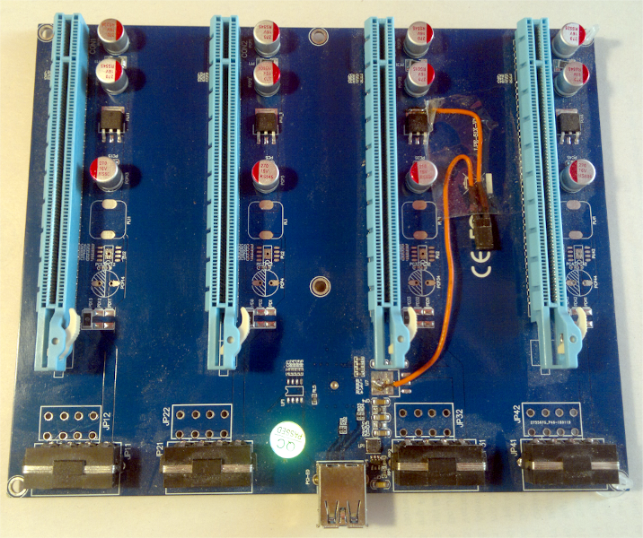

The PCIe port expander is just a special PCI-PCI bridge, which has one upstream (to the host) port and multiple of downstream (to a device) ports. Originally the boaard was most likely designed to connect multiple GPU cards into a mining rig. There is no reason for it to not work in a 486 machine with a similar purpose, so behold a 486 **HYDRA** setup:

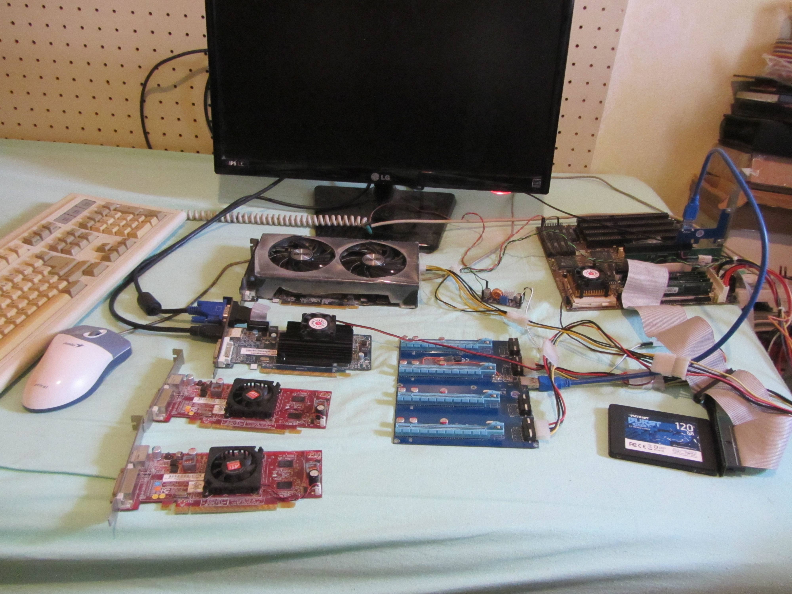

This supermultihead (aka hydra) configuration doesn't have any use. I don't even have nearly enough monitors to test it. It cannot be even used for any OpenCL computation as the linux needs LLVM to use OpenCL to compile GPU kernels and it wouldn't fit into RAM at all (somebody can try it though).

Also it is a pure luck there is enough PCI region space memory. There are chipsets, which would made this impossible. For example FinALI doesn't implement CPU address bits 27 to 30 and it is limited only to addressing a maximum of 128MB RAM and 128MB of PCI space (it can be more if there is less of the RAM - but it won't be continuous). Modern GPUs starts at 256MB PCI BARs (luckily RX460 can be modified to request less). But on FinALI it doesn't matter as it cannot operate in a busmaster mode anyway.

On UM8881/6 we will get this result:

```{=html}
<iframe width="50%" height="50%" src="https://www.youtube.com/embed/UlhfwlzpMb8" title="The Ultimate 486 Upgrade: Experiment Hydra" frameborder="0" allow="accelerometer; autoplay; clipboard-write; encrypted-media; gyroscope; picture-in-picture; web-share" referrerpolicy="strict-origin-when-cross-origin" allowfullscreen></iframe>
```

```{=latex}
\href{https://youtu.be/UlhfwlzpMb8}{\includegraphics{images/yt_UlhfwlzpMb8.jpg}}
```

### Network benchmark

Two ethernet cards ware tested a generic realtek RTL8139D and 3com 3C905C Etherlink. The benchmark consisted of an iperf3 server instance, which was started on 486 (10.0.0.86) and an iperf3 client on the host machine (10.0.0.1). The second benchmark was done via netcat and pipe viewer.

Measured results from the host machine for the RTL8139D card:

```
Connecting to host 10.0.0.86, port 5201
[  5] local 10.0.0.1 port 55676 connected to 10.0.0.86 port 5201
[ ID] Interval           Transfer     Bitrate         Retr  Cwnd
[  5]   0.00-1.00   sec  1.88 MBytes  15.7 Mbits/sec    9   33.9 KBytes
[  5]   1.00-2.00   sec  1.88 MBytes  15.7 Mbits/sec   17   26.9 KBytes
[  5]   2.00-3.00   sec  2.12 MBytes  17.8 Mbits/sec   12   26.9 KBytes
[  5]   3.00-4.00   sec  1.88 MBytes  15.7 Mbits/sec   13   28.3 KBytes
[  5]   4.00-5.00   sec  1.88 MBytes  15.7 Mbits/sec    8   28.3 KBytes
[  5]   5.00-6.00   sec  1.88 MBytes  15.7 Mbits/sec   13   35.4 KBytes
[  5]   6.00-7.00   sec  1.88 MBytes  15.7 Mbits/sec   14   32.5 KBytes
[  5]   7.00-8.00   sec  2.00 MBytes  16.8 Mbits/sec   11   31.1 KBytes
[  5]   8.00-9.00   sec  2.00 MBytes  16.8 Mbits/sec   11   35.4 KBytes
[  5]   9.00-10.00  sec  1.88 MBytes  15.7 Mbits/sec    8   33.9 KBytes
- - - - - - - - - - - - - - - - - - - - - - - - -
[ ID] Interval           Transfer     Bitrate         Retr
[  5]   0.00-10.00  sec  19.2 MBytes  16.1 Mbits/sec  116             sender
[  5]   0.00-10.01  sec  19.1 MBytes  16.0 Mbits/sec                  receiver
```

Measured results from the host machine for the 3com 3C905C Etherlink card:

```
Connecting to host 10.0.0.86, port 5201
[  5] local 10.0.0.1 port 43870 connected to 10.0.0.86 port 5201
[ ID] Interval           Transfer     Bitrate         Retr  Cwnd
[  5]   0.00-1.00   sec  3.62 MBytes  30.4 Mbits/sec    7   56.6 KBytes
[  5]   1.00-2.00   sec  3.25 MBytes  27.3 Mbits/sec    2   58.0 KBytes
[  5]   2.00-3.00   sec  3.38 MBytes  28.3 Mbits/sec    3   60.8 KBytes
[  5]   3.00-4.00   sec  3.38 MBytes  28.3 Mbits/sec    2   66.5 KBytes
[  5]   4.00-5.00   sec  3.25 MBytes  27.3 Mbits/sec    5   49.5 KBytes
[  5]   5.00-6.00   sec  3.50 MBytes  29.4 Mbits/sec    3   50.9 KBytes
[  5]   6.00-7.00   sec  3.25 MBytes  27.3 Mbits/sec    3   55.1 KBytes
[  5]   7.00-8.00   sec  3.38 MBytes  28.3 Mbits/sec    2   58.0 KBytes
[  5]   8.00-9.00   sec  3.38 MBytes  28.3 Mbits/sec    2   63.6 KBytes
[  5]   9.00-10.00  sec  3.50 MBytes  29.4 Mbits/sec    3   65.0 KBytes
- - - - - - - - - - - - - - - - - - - - - - - - -
[ ID] Interval           Transfer     Bitrate         Retr
[  5]   0.00-10.00  sec  33.9 MBytes  28.4 Mbits/sec   32             sender
[  5]   0.00-9.95   sec  33.6 MBytes  28.3 Mbits/sec                  receiver
```

It seems 3com card is almost twice as fast as the realtek one. The similar results was obtained from multiple realtek cards.

### Windows

It seems the retro community has a fondness of closed source operating systems, why not to make a SeaBIOS validation experiment by installing Win 2000 or some older Windows version.

First we need to burn a CDROM image and connect a drive the the system. For some reason the detection of CDROM/DVD in SeaBIOS is really slow, but eventually/after few tries it should start booting. There is a small problem the boot order is not implemented yet and the installer may get confused what is and what is not an HDD. For me it was fixed just by rebooting.

Another problem is SeaBIOS missing PIT (timer) initializations and some MSDOS applications will wait on one of the timer to overflow as a part of their waiting loop. This will lead to freezing the installation of windows 98SE. I think `mode.com` program is using it during the boot.

If the install doesn't fail we should be able to get into the desktop. Sadly there won't be any drivers for any modern GPU. Actually there is a driver for ATI HD5450, which was backported from win XP, but the situation is as expected a minimum required CPU generation which supports SSE, CMOV etc.

I really don't like poking inside Windows so I won't be fixing that. There are few possible ways: Modifying ATI radeon drivers to rewrite i686+ instructions with only ones available on i486 (possible, but there is lot's of libraries to modify). Adding the emulation to the Windows kernel (probably easier, but you need to poke inside windows kernel). Another way (and the prefered one) would be to port Mesa3D to windows :-D. And finally: not using Windows at all and doing the same work in ReactOS. It is open source and the result would be a modern Windows API (not sure what versions do they support, win11 ?) on 486 machine.

Installing a general VBE driver didn't work, either there was a black screen of the windows crashed with BSOD during the boot (same when it crashes with installed ATI radeon driver). Windows must be then either started in the safe mode or reverted to the last working state. BTW I must say disabling the serial mouse in the safe mode is an evil dead! (even worse, PS/2 mouse doesn't get disabled).

Generic VGA works well, but it offers only 640x480. But still I was able do a few experiments with that:

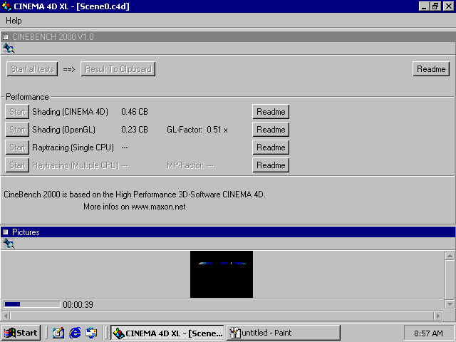

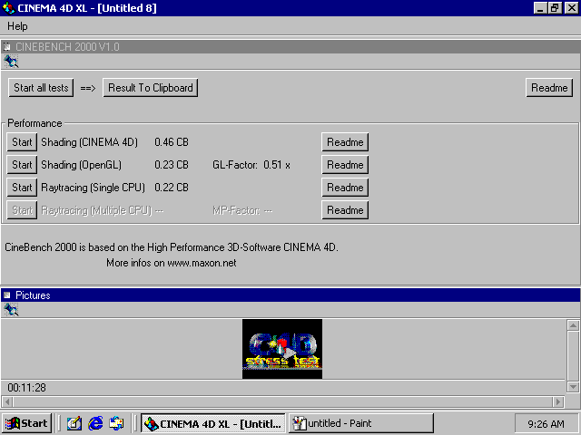

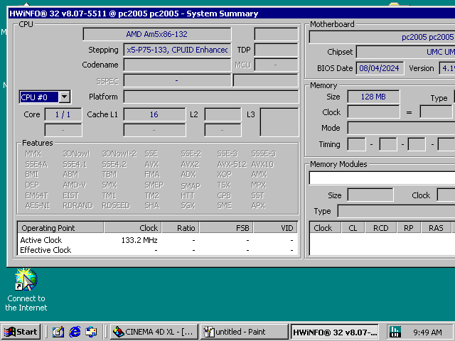

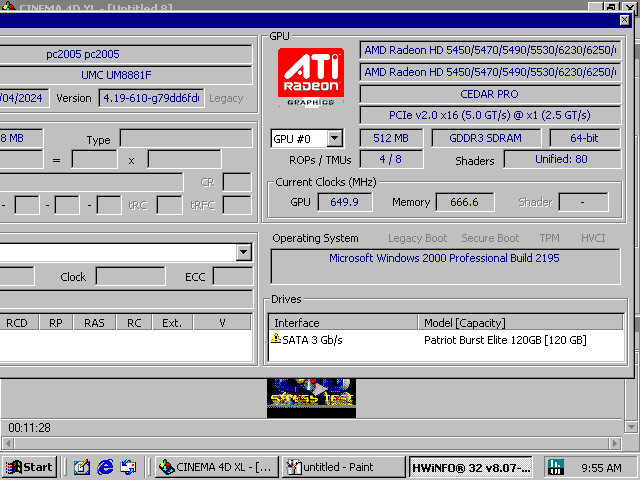

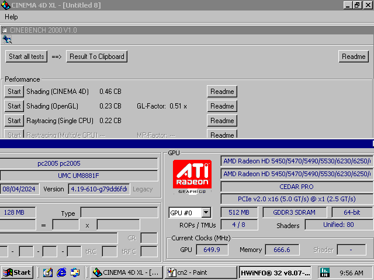

Now the cinebench 2k contest can have another _weird_ entry:

```
Cinebench 2000 V1.0 Performance
****************************************************

Tester           : <fill this out>

Processor        : <fill this out>
Number of CPUs   : 1
Physical Memory  : <fill this out>
Operating System : <fill this out>

Graphic Card     : <fill this out>
Resolution       : <fill this out>
Color Depth      : <fill this out>

****************************************************

Shading (CINEMA 4D)      : 0.46 CB
Shading (OpenGL)         : 0.23 CB
Raytracing (Single   CPU): 0.22 CB
Raytracing (Multiple CPU): --- CB

OpenGL Shading is 1.97 times slower than CINEMA 4D Shading!

****************************************************
```

The results had to be print screened segment by segment and stored in ms paint as a bitmap. I didn't stitched the segments together so the real pain of working with too big windows in 640x480 resolution can be seen by everybody :-P.

### Lower bound

For few years where still would be a compatibility of the modern GPU with the old PCI protocol, so any up to date GPU could be probably able to run in the 486 machine. And if not during the boot in SeaBIOS (for example because of removed option ROM support and relying only on UEFI), the linux driver would be able run the initialization. There is still a question:

Is the 486 motherboard the _oldest_ system which can support PCIe?

I don't plan to explore this path, but when I was researching PCI chipsets I've found [the OPTi 82C822 "VESA local bus to PCI bridge"](http://www.bitsavers.org/components/opti/dataSheets/82C822_VESA_to_PCI_Apr94.pdf). It was used as an IBM custom designed VLB riser board and it did exactly that. One of two (?) versions of the riser can be shown in Epictronics's video (around 8:45):

```{=html}
<iframe width="50%" height="50%" src="https://www.youtube.com/embed/UBfS_sDtpn8?start=525" title="IBM 350-466DX2 Rescued with Computer Reset part. Can we make it play Grand Theft Auto in High Color?" frameborder="0" allow="accelerometer; autoplay; clipboard-write; encrypted-media; gyroscope; picture-in-picture; web-share" referrerpolicy="strict-origin-when-cross-origin" allowfullscreen></iframe>
```

```{=latex}
\href{https://youtu.be/UBfS_sDtpn8?t=525}{\includegraphics{images/yt_UBfS_sDtpn8.jpg}}
```

If the card was converted to a regular VLB card or a new VLB card was made, it could be possible to use it in for example a 386 board. I think there were even 386sx VLB boards?

I will leave this topic open >-D.

## Conclusion

Finally we are at the end of this monstrous experiment. Do you think it was worth it? :-D

During the development there was a lot of suffering, especially guessing if L2 cache will initialize or it will crash the system (or more likely how should L2 cache initialize). But over all the feeling of being the only guy in the world with working PCIe GPU in a 486 system was nice \\m/.

Also it spawned the reversed engineered UMC datasheet (thanks to guys at Vogons forum).

There is still a lot of bugs, not sure if I gonna continue with the project, maybe in the basis "I want to boot from this different mobo and there is no CDROM support in the BIOS".

Also the FinALI support in Coreboot/SeaBIOS is probably not working now (with all the UMC changes). There could be an SiS496/7 support implemented and I even have a (damaged) board, but I don't have any time (it should be easier to do that when UMC support can be used as an inspiration). Intel 486 chipsets will be added only if somebody gives me a working board (well maybe not even then >-D).

Possible improvements of the coreboot would be ACPI (there wasn't much space left in the BIOS chip to implement that). Also coreboot should be merged with SeaBIOS (but SeaBIOS has a really poor code architecture). It would saved a lot of code though. Oh also a CMOS setup UI would be nice.

Best regards and keep hacking,

--pc2005

P.S. If any UMC representative reads this: disclose your UM8881/6 chipset datasheet :-P

P.P.S. I won't post here my bitcoin address (`16odFaRLqvfRNfsoewjV3rDB1jh2JyV4Ge`) as nobody donates anyway but if you like this work and you want to help the author you can always try to push the UMC to reveal the datasheet >-D. You can also add the support for your board or do more reverse engineering of the UMC chipset registers yourself. And if you really want to send a donation you can help the development of a reverse engineering tools [Radare](https://www.radare.org/r/me.html), the development of the [distribution which I use](https://www.patreon.com/slackwarelinux/overview) or effectively any project which was used here. Also you can donate to a [completely different cause](https://standwithukraine.com.ua/donation/).
